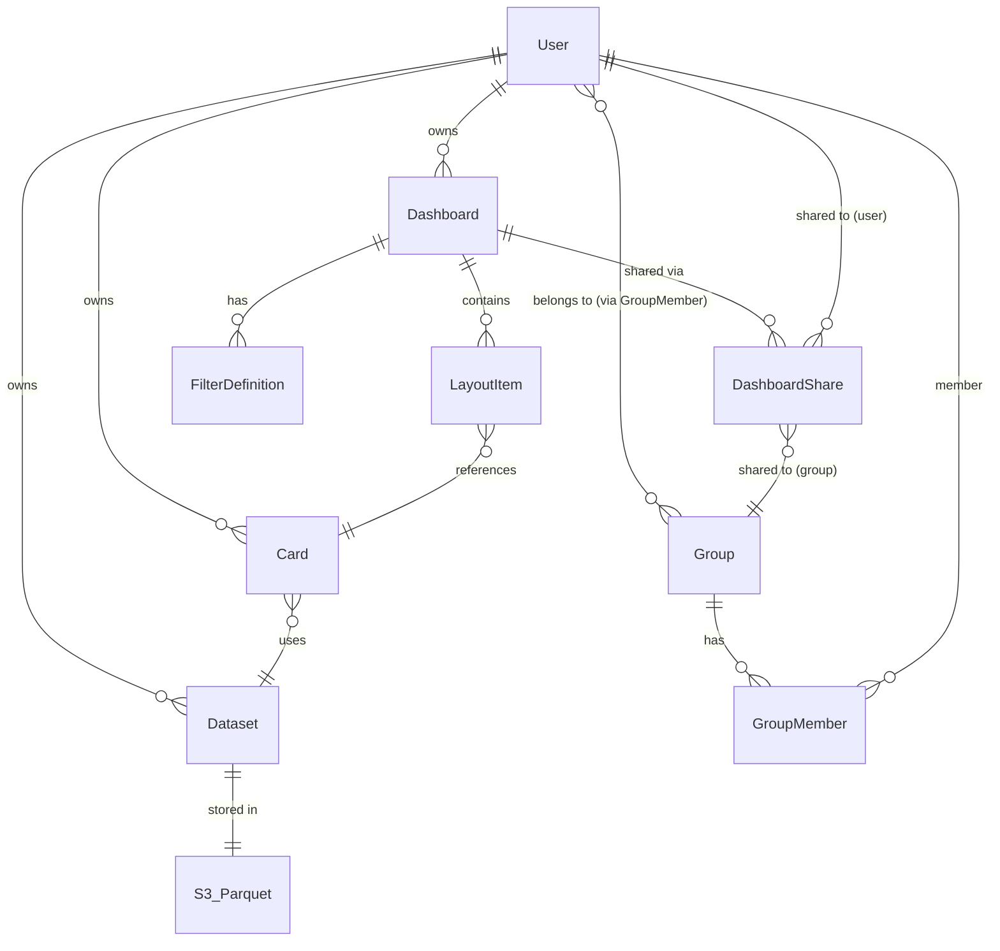

# データモデルとスキーマ コードマップ

最終更新: 2026-02-03 (FR-7 Dashboard Sharing / Group Management)
データベース: DynamoDB (NoSQL) + S3 (Parquet)

---

## DynamoDB テーブル一覧

テーブルプレフィックス: `bi_` (設定可能)

| テーブル名 | PK | SK | GSI | 用途 |
|-----------|-----|-----|-----|------|
| bi_users | userId (S) | - | UsersByEmail (email) | ユーザー |
| bi_datasets | datasetId (S) | - | DatasetsByOwner (ownerId + createdAt) | データセット |
| bi_cards | cardId (S) | - | CardsByOwner (ownerId + createdAt) | カード |
| bi_dashboards | dashboardId (S) | - | DashboardsByOwner (ownerId + createdAt) | ダッシュボード |
| bi_filter_views | filterViewId (S) | - | FilterViewsByDashboard (dashboardId + createdAt) | フィルタービュー |
| bi_groups | groupId (S) | - | GroupsByName (name) | グループ |
| bi_group_members | groupId (S) | userId (S) | MembersByUser (userId) | グループメンバー |
| bi_dashboard_shares | shareId (S) | - | SharesByDashboard (dashboardId), SharesByTarget (sharedToId) | ダッシュボード共有 |

BillingMode: PAY_PER_REQUEST (全テーブル)

---

## DynamoDB スキーマ詳細

### bi_users

| 属性 | 型 | DynamoDB型 | 説明 |
|------|-----|-----------|------|
| userId | PK | S | UUID |
| email | GSI-PK | S | メールアドレス (一意) |
| hashedPassword | - | S | bcrypt ハッシュ |
| role | - | S | ロール ("user" / "admin", デフォルト "user") |
| createdAt | - | N | UNIX タイムスタンプ |
| updatedAt | - | N | UNIX タイムスタンプ |

GSI: `UsersByEmail` (PK: email, Projection: ALL)

### bi_datasets

| 属性 | 型 | DynamoDB型 | 説明 |
|------|-----|-----------|------|
| datasetId | PK | S | ds_XXXXXXXXXXXX 形式 |
| name | - | S | 表示名 |
| description | - | S | 説明 (nullable) |
| sourceType | - | S | "csv" |
| rowCount | - | N | 行数 |
| columnCount | - | N | 列数 |
| schema | - | L(M) | ColumnSchema のリスト |
| ownerId | GSI-PK | S | オーナー ID |
| s3Path | - | S | S3 パス |
| partitionColumn | - | S | パーティション列名 (nullable) |
| sourceConfig | - | M | ソース設定 (nullable) |
| lastImportAt | - | N | 最終インポート日時 |
| lastImportBy | - | S | 最終インポートユーザー |
| createdAt | GSI-SK | N | UNIX タイムスタンプ |
| updatedAt | - | N | UNIX タイムスタンプ |

GSI: `DatasetsByOwner` (PK: ownerId, SK: createdAt, Projection: ALL)

### bi_cards

| 属性 | 型 | DynamoDB型 | 説明 |
|------|-----|-----------|------|
| cardId | PK | S | UUID |
| name | - | S | 表示名 |
| code | - | S | Python コード |
| description | - | S | 説明 (nullable) |
| datasetId | - | S | 対象データセット ID (nullable) |
| datasetIds | - | L(S) | 複数データセット ID (nullable) |
| params | - | M | カードパラメータ (nullable) |
| usedColumns | - | L(S) | 使用列 (nullable) |
| filterApplicable | - | BOOL | フィルタ適用可否 (nullable) |
| ownerId | GSI-PK | S | オーナー ID |
| createdAt | GSI-SK | N | UNIX タイムスタンプ |
| updatedAt | - | N | UNIX タイムスタンプ |

GSI: `CardsByOwner` (PK: ownerId, SK: createdAt, Projection: ALL)

### bi_dashboards

| 属性 | 型 | DynamoDB型 | 説明 |
|------|-----|-----------|------|
| dashboardId | PK | S | UUID |
| name | - | S | 表示名 |
| description | - | S | 説明 (nullable) |
| layout | - | L(M) | LayoutItem のリスト |
| filters | - | L(M) | FilterDefinition のリスト |
| defaultFilterViewId | - | S | デフォルトフィルタービュー (nullable) |
| ownerId | GSI-PK | S | オーナー ID |
| createdAt | GSI-SK | N | UNIX タイムスタンプ |
| updatedAt | - | N | UNIX タイムスタンプ |

GSI: `DashboardsByOwner` (PK: ownerId, SK: createdAt, Projection: ALL)

### bi_filter_views

| 属性 | 型 | DynamoDB型 | 説明 |
|------|-----|-----------|------|
| filterViewId | PK | S | UUID |
| dashboardId | GSI-PK | S | 対象ダッシュボード ID |
| name | - | S | ビュー名 |
| values | - | M | フィルタ値 |
| ownerId | - | S | 作成者 ID |
| createdAt | GSI-SK | N | UNIX タイムスタンプ |
| updatedAt | - | N | UNIX タイムスタンプ |

GSI: `FilterViewsByDashboard` (PK: dashboardId, SK: createdAt, Projection: ALL)

### bi_groups [FR-7]

| 属性 | 型 | DynamoDB型 | 説明 |
|------|-----|-----------|------|
| groupId | PK | S | UUID |
| name | GSI-PK | S | グループ名 (一意) |
| createdAt | - | N | UNIX タイムスタンプ |
| updatedAt | - | N | UNIX タイムスタンプ |

GSI: `GroupsByName` (PK: name, Projection: ALL)

### bi_group_members [FR-7]

| 属性 | 型 | DynamoDB型 | 説明 |
|------|-----|-----------|------|
| groupId | PK | S | グループ ID |
| userId | SK / GSI-PK | S | ユーザー ID (複合キー) |
| addedAt | - | N | UNIX タイムスタンプ |

PK + SK の複合キーテーブル (groupId + userId)
GSI: `MembersByUser` (PK: userId, Projection: ALL)

### bi_dashboard_shares [FR-7]

| 属性 | 型 | DynamoDB型 | 説明 |
|------|-----|-----------|------|
| shareId | PK | S | UUID |
| dashboardId | GSI-PK | S | 共有対象ダッシュボード ID |
| sharedToType | - | S | "user" または "group" |
| sharedToId | GSI-PK | S | 共有先ユーザー/グループ ID |
| permission | - | S | "owner" / "editor" / "viewer" |
| sharedBy | - | S | 共有実行ユーザー ID |
| createdAt | - | N | UNIX タイムスタンプ |

GSI-1: `SharesByDashboard` (PK: dashboardId, Projection: ALL)
GSI-2: `SharesByTarget` (PK: sharedToId, Projection: ALL)

---

## S3 ストレージ

バケット: `bi-datasets`

```
bi-datasets/
  datasets/{datasetId}/
    data/
      part-0000.parquet              # 非パーティション
    partitions/
      {column}={value}/
        part-0000.parquet            # パーティション分割
```

フォーマット: Apache Parquet (Snappy 圧縮)

---

## Pydantic モデル (Backend)

### common.py

```python
class BaseResponse:
    success: bool
    data: Any | None
    error: str | None

class TimestampMixin:
    created_at: datetime   # default: now(UTC)
    updated_at: datetime   # default: now(UTC)
```

### user.py

```python
class UserCreate:
    email: EmailStr
    password: str          # min 8, 大文字/小文字/数字/特殊文字

class UserInDB:            # DB保存用 (hashedPassword含む)
    id: str
    email: str
    hashed_password: str
    role: str = "user"     # [FR-7] "user" / "admin"
    created_at: datetime
    updated_at: datetime

class User:                # 公開用 (hashedPassword除外)
    id: str
    email: str
    role: str = "user"     # [FR-7] "user" / "admin"
    created_at: datetime
    updated_at: datetime

class UserUpdate:
    password: str | None   # バリデーション付き
```

### dataset.py

```python
class ColumnSchema:
    name: str
    data_type: str         # int64, float64, bool, date, datetime, string
    nullable: bool
    description: str | None

class DatasetCreate:
    name: str
    description: str | None
    source_type: str
    partition_column: str | None

class DatasetUpdate:
    name: str | None
    description: str | None
    partition_column: str | None

class Dataset(TimestampMixin):
    id: str
    name: str
    description: str | None
    source_type: str
    row_count: int
    columns: list[ColumnSchema]   # alias="schema"
    owner_id: str | None
    s3_path: str | None
    partition_column: str | None
    source_config: dict | None
    column_count: int
    last_import_at: datetime | None
    last_import_by: str | None
```

### card.py

```python
class CardCreate:
    name: str
    code: str
    description: str | None
    dataset_ids: list[str] | None
    dataset_id: str | None
    params: dict | None

class CardUpdate:
    name: str | None
    code: str | None
    description: str | None
    dataset_ids: list[str] | None
    dataset_id: str | None
    params: dict | None

class Card(TimestampMixin):
    id: str
    name: str
    code: str
    description: str | None
    dataset_ids: list[str] | None
    dataset_id: str | None
    params: dict | None
    used_columns: list[str] | None
    filter_applicable: bool | None
    owner_id: str | None
```

### dashboard.py

```python
class FilterDefinition:
    id: str
    type: str
    column: str
    label: str
    multi_select: bool = False
    options: list[str] | None = None    # カテゴリフィルタ選択肢

class LayoutItem:
    card_id: str
    x: int (>= 0)
    y: int (>= 0)
    w: int (>= 1)
    h: int (>= 1)

class DashboardCreate:
    name: str
    description: str | None
    layout: list[LayoutItem] | None
    filters: list[FilterDefinition] | None

class DashboardUpdate:
    name: str | None
    description: str | None
    layout: list[LayoutItem] | None
    filters: list[FilterDefinition] | None

class Dashboard(TimestampMixin):
    id: str
    name: str
    description: str | None
    layout: list[LayoutItem] | None
    owner_id: str | None
    filters: list[FilterDefinition] | None
    default_filter_view_id: str | None
```

### dashboard_share.py [FR-7]

```python
class Permission(str, Enum):
    OWNER = "owner"
    EDITOR = "editor"
    VIEWER = "viewer"

class SharedToType(str, Enum):
    USER = "user"
    GROUP = "group"

class DashboardShare:
    id: str
    dashboard_id: str
    shared_to_type: SharedToType
    shared_to_id: str
    permission: Permission
    shared_by: str
    created_at: datetime

class DashboardShareCreate:
    shared_to_type: SharedToType
    shared_to_id: str
    permission: Permission

class DashboardShareUpdate:
    permission: Permission
```

### group.py [FR-7]

```python
class Group(TimestampMixin):
    id: str
    name: str

class GroupCreate:
    name: str              # min_length=1, 空白バリデーション

class GroupUpdate:
    name: str | None       # min_length=1, 空白バリデーション

class GroupMember:
    group_id: str
    user_id: str
    added_at: datetime
```

---

## APIレスポンスヘルパー (Backend)

```python
# api/response.py
def api_response(data: Any) -> Dict[str, Any]:
    """{ "data": T }"""

def paginated_response(items, total, limit, offset) -> Dict[str, Any]:
    """{ "data": [...], "pagination": { "total", "limit", "offset", "has_next" } }"""
```

全ルートの返却値をこれらのヘルパーでラップし、
Frontend の `ApiResponse<T>` / `PaginatedResponse<T>` 型と構造を統一。

---

## Executor モデル

### api_models.py

```python
class ExecuteCardRequest:
    card_id: str
    code: str
    dataset_id: str
    filters: dict = {}
    params: dict = {}
    dataset_rows: list[dict] | None   # 将来拡張用

class ExecuteCardResponse:
    html: str
    used_columns: list[str] = []
    filter_applicable: list[str] = []
    execution_time_ms: int

class ExecuteErrorResponse:
    error: str
    detail: str | None
```

### models.py

```python
@dataclass
class HTMLResult:
    html: str
    used_columns: list[str] = []
    filter_applicable: list[str] = []
```

---

## TypeScript 型定義 (Frontend)

### api.ts

```typescript
interface ApiResponse<T> { data: T; meta?: { request_id: string } }
interface ApiErrorResponse { error: { code: string; message: string; details?: Record<string, unknown> } }
interface PaginatedResponse<T> { data: T[]; pagination: Pagination }
interface Pagination { total: number; limit: number; offset: number; has_next: boolean }
interface PaginationParams { limit?: number; offset?: number }
```

### user.ts

```typescript
interface User { user_id: string; email: string; name?: string; role?: string; created_at: string }
interface UserWithGroups extends User { groups: GroupRef[] }
interface GroupRef { group_id: string; name: string }
interface LoginRequest { email: string; password: string }
interface LoginResponse { access_token: string; token_type: string; expires_in: number; user: User }
```

### dataset.ts

```typescript
interface ColumnSchema { name: string; type: string; nullable: boolean }
interface OwnerRef { user_id: string; name: string }
interface Dataset { dataset_id: string; name: string; source_type: string; row_count: number; column_count: number; owner: OwnerRef; created_at: string; last_import_at?: string }
interface DatasetDetail extends Dataset { source_config?: Record<string, unknown> | null; schema: ColumnSchema[]; s3_path?: string; partition_column?: string; updated_at: string; last_import_by?: OwnerRef }
interface DatasetCreateRequest { file: File; name: string; has_header?: boolean; delimiter?: string; encoding?: string; partition_column?: string }
interface DatasetUpdateRequest { name?: string; partition_column?: string }
interface DatasetPreview { columns: string[]; rows: unknown[][]; total_rows: number; preview_rows: number }
```

### card.ts

```typescript
interface Card { card_id: string; name: string; dataset?: CardRef; used_columns?: string[]; filter_applicable?: string[]; owner: OwnerRef; created_at: string }
interface CardDetail extends Card { code: string; params?: Record<string, unknown>; description?: string; updated_at: string }
interface CardCreateRequest { name: string; dataset_id: string; code: string; params?: Record<string, unknown> }
interface CardUpdateRequest { name?: string; code?: string; params?: Record<string, unknown> }
interface CardExecuteRequest { filters?: Record<string, unknown>; use_cache?: boolean }
interface CardExecuteResponse { card_id: string; html: string; cached: boolean; execution_time_ms: number }
interface CardPreviewResponse { card_id: string; html: string; execution_time_ms: number; input_row_count: number; filtered_row_count: number }
```

### dashboard.ts

```typescript
interface LayoutItem { card_id: string; x: number; y: number; w: number; h: number }
interface FilterDefinition { id: string; type: 'category' | 'date_range'; column: string; label: string; multi_select?: boolean; options?: string[] }
interface DashboardLayout { cards: LayoutItem[]; columns: number; row_height: number }
interface Dashboard { dashboard_id: string; name: string; card_count: number; owner: OwnerRef; my_permission?: string; created_at: string; updated_at: string }
interface DashboardDetail extends Omit<Dashboard, 'card_count'> { layout: DashboardLayout; filters: FilterDefinition[]; default_filter_view_id?: string; description?: string }
interface DashboardCreateRequest { name: string }
interface DashboardUpdateRequest { name?: string; layout?: DashboardLayout; filters?: FilterDefinition[] }

// [FR-7] Sharing 型
type Permission = 'owner' | 'editor' | 'viewer'
type SharedToType = 'user' | 'group'
interface DashboardShare { id: string; dashboard_id: string; shared_to_type: SharedToType; shared_to_id: string; permission: Permission; shared_by: string; created_at: string }
interface ShareCreateRequest { shared_to_type: SharedToType; shared_to_id: string; permission: Permission }
interface ShareUpdateRequest { permission: Permission }
```

### group.ts [FR-7]

```typescript
interface Group { id: string; name: string; created_at: string; updated_at: string }
interface GroupDetail extends Group { members: GroupMember[] }
interface GroupMember { group_id: string; user_id: string; added_at: string }
interface GroupCreateRequest { name: string }
interface GroupUpdateRequest { name?: string }
interface AddMemberRequest { user_id: string }
```

---

## Type Guard 関数

| 関数 | ファイル | 対象型 |
|------|---------|--------|
| `isUser()` | user.ts | User |
| `isLoginResponse()` | user.ts | LoginResponse |
| `isDataset()` | dataset.ts | Dataset |
| `isColumnSchema()` | dataset.ts | ColumnSchema |
| `isCard()` | card.ts | Card |
| `isDashboard()` | dashboard.ts | Dashboard |
| `isLayoutItem()` | dashboard.ts | LayoutItem |
| `isGroup()` | group.ts | Group |
| `isApiErrorResponse()` | api.ts | ApiErrorResponse |
| `isPagination()` | api.ts | Pagination |

---

## エンティティ関係図



```
  User (bi_users)
    |
    +--< owns >-- Dataset (bi_datasets) ---> S3 Parquet
    |
    +--< owns >-- Card (bi_cards)
    |               |
    |               +-- dataset_id --> Dataset
    |
    +--< owns >-- Dashboard (bi_dashboards)
    |               |
    |               +-- layout[].card_id --> Card
    |               +-- filters[] --> FilterDefinition (options --> Dataset column values)
    |               +-- clone --> new Dashboard (owner=current_user)
    |               |
    |               +--< shared via >-- DashboardShare (bi_dashboard_shares)
    |                                     |
    |                                     +-- shared_to_type="user"  --> User
    |                                     +-- shared_to_type="group" --> Group
    |
    +--< member of >-- GroupMember (bi_group_members)
                          |
                          +-- group_id --> Group (bi_groups)
```

## Permission モデル [FR-7]

ダッシュボードのアクセス権限は以下の順序で解決される:

```
1. Owner (ダッシュボード作成者)         --> permission = "owner"
2. DashboardShare (user 直接共有)       --> permission = "editor" | "viewer"
3. DashboardShare (group 経由共有)      --> permission = "editor" | "viewer"
4. 上記いずれにも該当しない             --> アクセス不可
```

Permission の優先度: owner > editor > viewer
複数の共有 (user + group) がある場合、最も高い権限が適用される。

## DynamoDB キーパターン (camelCase)

BaseRepository で自動変換:
- Python: `snake_case` (created_at) <--> DynamoDB: `camelCase` (createdAt)
- Python: `id` <--> DynamoDB: テーブル固有PK名 (userId, datasetId, groupId, shareId, etc.)
- Python: `datetime` <--> DynamoDB: `Number` (UNIX timestamp)

例外: GroupMemberRepository は BaseRepository を継承せず、独自の変換ロジックを使用
(複合キー groupId + userId を直接操作)

## Backend <--> Frontend レスポンスマッピング

| Backend レスポンス | Frontend 型 | 備考 |
|-------------------|------------|------|
| `api_response(data)` | `ApiResponse<T>` | `{ data: T }` |
| `paginated_response(...)` | `PaginatedResponse<T>` | `{ data: T[], pagination: Pagination }` |
| HTTPException 4xx/5xx | `ApiErrorResponse` | `{ error: { code, message } }` |

一覧 API (GET /datasets, /cards, /dashboards) は全て `paginated_response()` を使用し、
`limit` / `offset` クエリパラメータを受け付ける (デフォルト: limit=50, offset=0)。

## 関連コードマップ

- [architecture.md](./architecture.md) - 全体アーキテクチャ
- [backend.md](./backend.md) - バックエンド構造
- [frontend.md](./frontend.md) - フロントエンド構造
