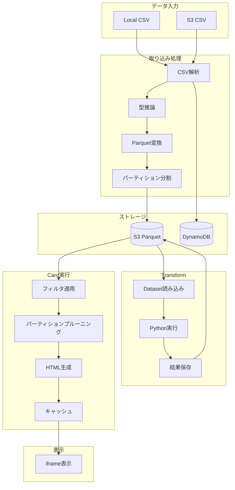
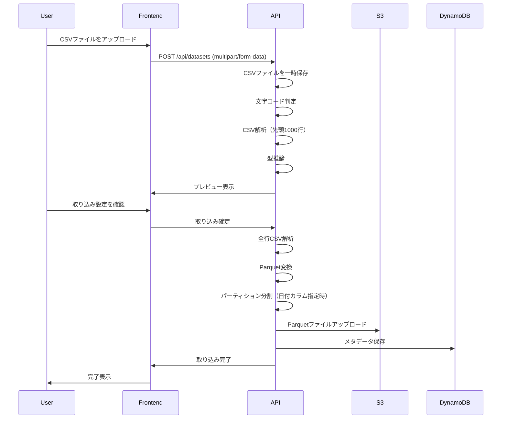
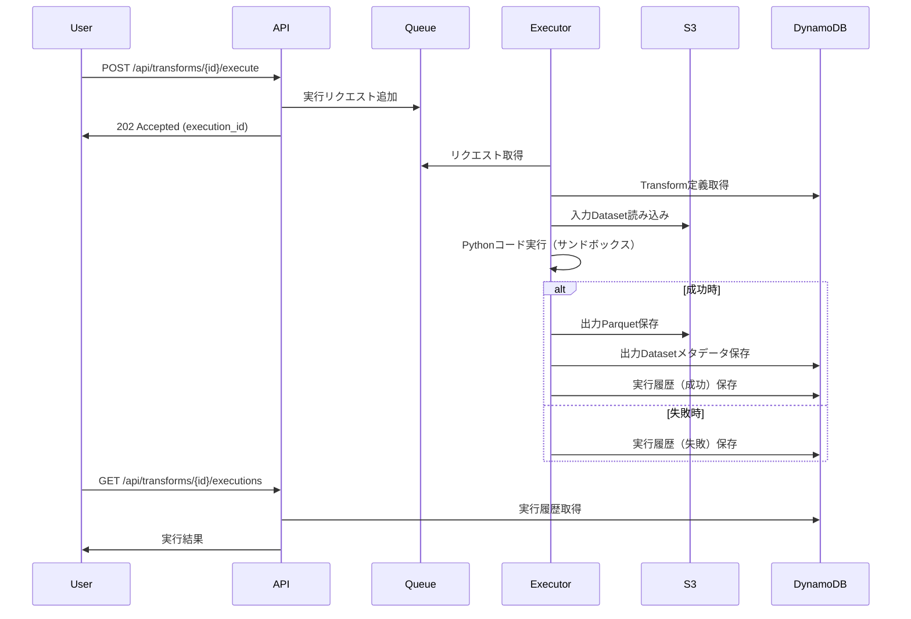
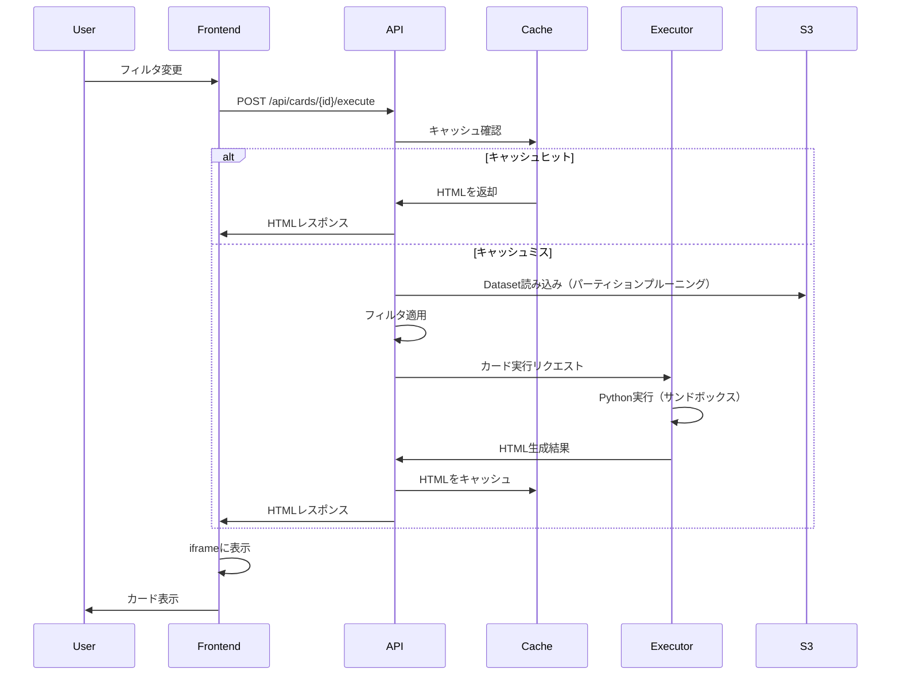
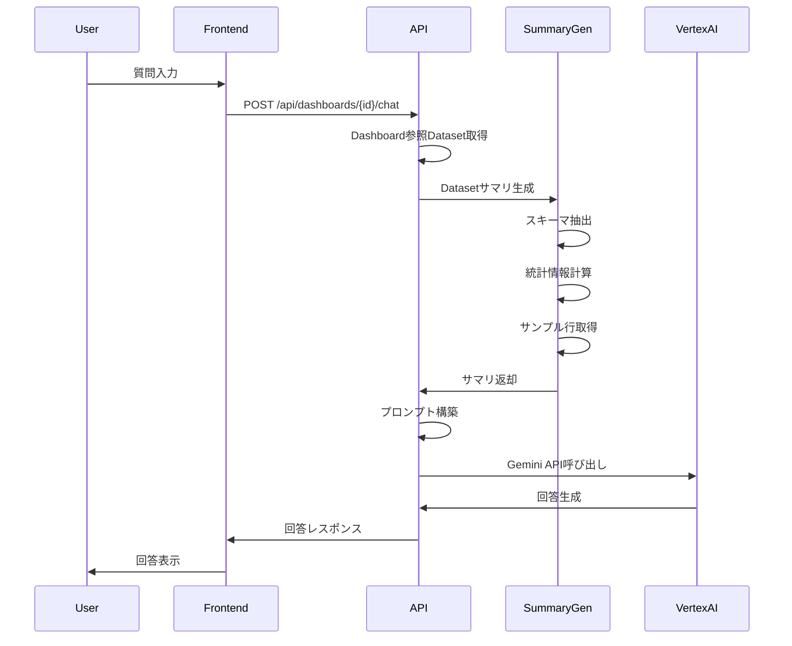

# 社内BI・Pythonカード データフロー詳細仕様書 v0.1

## 1. データフロー概要



---

## 2. Dataset取り込みフロー

### 2.1 Local CSV取り込み



### 2.2 CSV解析処理

```python
import pandas as pd
import chardet
from io import BytesIO

class CsvParser:
    def __init__(self, options: CsvImportOptions):
        self.options = options
    
    def detect_encoding(self, file_bytes: bytes) -> str:
        """文字コード自動判定"""
        if self.options.encoding:
            return self.options.encoding
        
        # 先頭10KB で判定
        result = chardet.detect(file_bytes[:10240])
        detected = result['encoding']
        
        # 日本語エンコーディングの補正
        encoding_map = {
            'ascii': 'utf-8',
            'ISO-8859-1': 'cp932',  # 日本語の場合
        }
        return encoding_map.get(detected, detected)
    
    def parse_preview(self, file_bytes: bytes, max_rows: int = 1000) -> pd.DataFrame:
        """プレビュー用解析（先頭max_rows行）"""
        encoding = self.detect_encoding(file_bytes)
        
        df = pd.read_csv(
            BytesIO(file_bytes),
            encoding=encoding,
            delimiter=self.options.delimiter,
            header=0 if self.options.has_header else None,
            nrows=max_rows,
            na_values=self.options.null_values,
            skip_blank_lines=True,
        )
        return df
    
    def parse_full(self, file_bytes: bytes) -> pd.DataFrame:
        """全行解析"""
        encoding = self.detect_encoding(file_bytes)
        
        df = pd.read_csv(
            BytesIO(file_bytes),
            encoding=encoding,
            delimiter=self.options.delimiter,
            header=0 if self.options.has_header else None,
            na_values=self.options.null_values,
            skip_blank_lines=True,
            low_memory=False,  # 型推論の一貫性
        )
        return df
```

### 2.3 型推論処理

```python
from datetime import datetime
import numpy as np

class TypeInferrer:
    DATE_FORMATS = [
        '%Y-%m-%d',
        '%Y/%m/%d',
        '%Y年%m月%d日',
    ]
    
    DATETIME_FORMATS = [
        '%Y-%m-%d %H:%M:%S',
        '%Y-%m-%dT%H:%M:%S',
        '%Y-%m-%dT%H:%M:%SZ',
        '%Y-%m-%dT%H:%M:%S.%f',
    ]
    
    def infer_column_type(self, series: pd.Series) -> str:
        """列の型を推論"""
        # NULLを除外
        non_null = series.dropna()
        if len(non_null) == 0:
            return 'string'
        
        # 既に数値型の場合
        if pd.api.types.is_integer_dtype(series):
            return 'int64'
        if pd.api.types.is_float_dtype(series):
            return 'float64'
        if pd.api.types.is_bool_dtype(series):
            return 'bool'
        
        # 文字列から型を推論
        sample = non_null.head(1000).astype(str)
        
        # 日付型チェック
        if self._is_date(sample):
            return 'date'
        if self._is_datetime(sample):
            return 'datetime'
        
        # 数値型チェック
        if self._is_integer(sample):
            return 'int64'
        if self._is_float(sample):
            return 'float64'
        
        # ブール型チェック
        if self._is_bool(sample):
            return 'bool'
        
        return 'string'
    
    def _is_date(self, sample: pd.Series) -> bool:
        for fmt in self.DATE_FORMATS:
            try:
                pd.to_datetime(sample, format=fmt, errors='raise')
                return True
            except:
                continue
        return False
    
    def _is_datetime(self, sample: pd.Series) -> bool:
        for fmt in self.DATETIME_FORMATS:
            try:
                pd.to_datetime(sample, format=fmt, errors='raise')
                return True
            except:
                continue
        return False
    
    def _is_integer(self, sample: pd.Series) -> bool:
        try:
            converted = pd.to_numeric(sample, errors='raise')
            return (converted == converted.astype(int)).all()
        except:
            return False
    
    def _is_float(self, sample: pd.Series) -> bool:
        try:
            pd.to_numeric(sample, errors='raise')
            return True
        except:
            return False
    
    def _is_bool(self, sample: pd.Series) -> bool:
        bool_values = {'true', 'false', 'True', 'False', '1', '0', 'yes', 'no'}
        return sample.str.lower().isin(bool_values).all()
    
    def apply_types(self, df: pd.DataFrame, schema: list[dict]) -> pd.DataFrame:
        """推論した型を適用"""
        for col_info in schema:
            col_name = col_info['name']
            col_type = col_info['type']
            
            if col_type == 'int64':
                df[col_name] = pd.to_numeric(df[col_name], errors='coerce').astype('Int64')
            elif col_type == 'float64':
                df[col_name] = pd.to_numeric(df[col_name], errors='coerce')
            elif col_type == 'bool':
                df[col_name] = df[col_name].map({
                    'true': True, 'True': True, '1': True, 'yes': True,
                    'false': False, 'False': False, '0': False, 'no': False,
                })
            elif col_type == 'date':
                df[col_name] = pd.to_datetime(df[col_name], errors='coerce').dt.date
            elif col_type == 'datetime':
                df[col_name] = pd.to_datetime(df[col_name], errors='coerce')
        
        return df
```

### 2.4 Parquet変換・保存

```python
import pyarrow as pa
import pyarrow.parquet as pq
from pathlib import Path

class ParquetConverter:
    def __init__(self, s3_client, bucket: str):
        self.s3_client = s3_client
        self.bucket = bucket
    
    def convert_and_save(
        self,
        df: pd.DataFrame,
        dataset_id: str,
        partition_column: str | None = None
    ) -> dict:
        """DataFrameをParquetに変換してS3に保存"""
        
        table = pa.Table.from_pandas(df, preserve_index=False)
        
        if partition_column and partition_column in df.columns:
            return self._save_partitioned(table, dataset_id, partition_column)
        else:
            return self._save_single(table, dataset_id)
    
    def _save_single(self, table: pa.Table, dataset_id: str) -> dict:
        """単一ファイルとして保存"""
        s3_path = f"datasets/{dataset_id}/data/part-0000.parquet"
        
        # メモリ上でParquet化
        buffer = pa.BufferOutputStream()
        pq.write_table(table, buffer, compression='snappy')
        
        # S3にアップロード
        self.s3_client.put_object(
            Bucket=self.bucket,
            Key=s3_path,
            Body=buffer.getvalue().to_pybytes()
        )
        
        return {
            's3_path': f"s3://{self.bucket}/{s3_path}",
            'partitioned': False,
        }
    
    def _save_partitioned(
        self,
        table: pa.Table,
        dataset_id: str,
        partition_column: str
    ) -> dict:
        """パーティション分割して保存"""
        base_path = f"datasets/{dataset_id}/partitions"
        
        # パーティションごとにグループ化
        df = table.to_pandas()
        
        # 日付カラムをYYYY-MM-DD形式に
        if pd.api.types.is_datetime64_any_dtype(df[partition_column]):
            df['_partition_key'] = df[partition_column].dt.strftime('%Y-%m-%d')
        else:
            df['_partition_key'] = df[partition_column].astype(str)
        
        partitions = []
        for partition_value, group in df.groupby('_partition_key'):
            group = group.drop(columns=['_partition_key'])
            partition_table = pa.Table.from_pandas(group, preserve_index=False)
            
            s3_key = f"{base_path}/{partition_column}={partition_value}/part-0000.parquet"
            
            buffer = pa.BufferOutputStream()
            pq.write_table(partition_table, buffer, compression='snappy')
            
            self.s3_client.put_object(
                Bucket=self.bucket,
                Key=s3_key,
                Body=buffer.getvalue().to_pybytes()
            )
            
            partitions.append({
                'partition_value': partition_value,
                'row_count': len(group),
            })
        
        return {
            's3_path': f"s3://{self.bucket}/{base_path}/",
            'partitioned': True,
            'partition_column': partition_column,
            'partitions': partitions,
        }
```

---

## 3. Transform実行フロー

### 3.1 シーケンス



### 3.2 Transform実行エンジン

```python
import pandas as pd
from typing import Callable
import traceback

class TransformRunner:
    def __init__(self, s3_client, dynamodb_client):
        self.s3_client = s3_client
        self.dynamodb_client = dynamodb_client
        self.parquet_reader = ParquetReader(s3_client)
        self.parquet_converter = ParquetConverter(s3_client, BUCKET_NAME)
    
    async def execute(self, transform_id: str, params: dict = None) -> dict:
        """Transform実行"""
        # Transform定義取得
        transform = await self.dynamodb_client.get_transform(transform_id)
        
        # 入力Dataset読み込み
        inputs = {}
        for dataset_id in transform['input_dataset_ids']:
            dataset = await self.dynamodb_client.get_dataset(dataset_id)
            df = self.parquet_reader.read_full(dataset['s3_path'])
            inputs[dataset_id] = df
        
        # コード実行
        try:
            result_df = self._execute_code(
                code=transform['code'],
                inputs=inputs,
                params=params or transform.get('params', {})
            )
        except Exception as e:
            return {
                'status': 'failed',
                'error': str(e),
                'traceback': traceback.format_exc(),
            }
        
        # 出力Dataset保存
        output_dataset_id = transform.get('output_dataset_id') or generate_id('ds')
        
        save_result = self.parquet_converter.convert_and_save(
            df=result_df,
            dataset_id=output_dataset_id,
            partition_column=transform.get('output_partition_column'),
        )
        
        # メタデータ保存
        schema = self._extract_schema(result_df)
        await self.dynamodb_client.upsert_dataset({
            'dataset_id': output_dataset_id,
            'name': f"{transform['name']}_output",
            'source_type': 'transform',
            'source_config': {'transform_id': transform_id},
            'schema': schema,
            'row_count': len(result_df),
            'column_count': len(result_df.columns),
            's3_path': save_result['s3_path'],
            'owner_id': transform['owner_id'],
        })
        
        return {
            'status': 'success',
            'output_dataset_id': output_dataset_id,
            'row_count': len(result_df),
        }
    
    def _execute_code(
        self,
        code: str,
        inputs: dict[str, pd.DataFrame],
        params: dict
    ) -> pd.DataFrame:
        """Pythonコードを安全に実行"""
        # グローバル名前空間を制限
        allowed_globals = {
            '__builtins__': {
                'len': len,
                'range': range,
                'enumerate': enumerate,
                'zip': zip,
                'map': map,
                'filter': filter,
                'sorted': sorted,
                'sum': sum,
                'min': min,
                'max': max,
                'abs': abs,
                'round': round,
                'list': list,
                'dict': dict,
                'set': set,
                'tuple': tuple,
                'str': str,
                'int': int,
                'float': float,
                'bool': bool,
                'print': print,
            },
            'pd': pd,
            'np': __import__('numpy'),
        }
        
        local_namespace = {}
        
        # コードをコンパイル・実行
        exec(code, allowed_globals, local_namespace)
        
        # transform関数を取得
        if 'transform' not in local_namespace:
            raise ValueError("コードにtransform関数が定義されていません")
        
        transform_func = local_namespace['transform']
        
        # 関数を実行
        result = transform_func(inputs, params)
        
        if not isinstance(result, pd.DataFrame):
            raise ValueError("transform関数はDataFrameを返す必要があります")
        
        return result
    
    def _extract_schema(self, df: pd.DataFrame) -> list[dict]:
        """DataFrameからスキーマを抽出"""
        schema = []
        for col in df.columns:
            dtype = str(df[col].dtype)
            nullable = df[col].isna().any()
            
            # PyArrow型にマッピング
            type_map = {
                'int64': 'int64',
                'Int64': 'int64',
                'float64': 'float64',
                'object': 'string',
                'bool': 'bool',
                'datetime64[ns]': 'datetime',
            }
            
            schema.append({
                'name': col,
                'type': type_map.get(dtype, 'string'),
                'nullable': nullable,
            })
        
        return schema
```

---

## 4. Card実行フロー

### 4.1 シーケンス



### 4.2 フィルタ適用処理

```python
from dataclasses import dataclass
from typing import Any
import pandas as pd

@dataclass
class CategoryFilter:
    column: str
    values: list[str]
    include_null: bool = False

@dataclass
class DateRangeFilter:
    column: str
    start: str  # YYYY-MM-DD
    end: str    # YYYY-MM-DD

class FilterApplier:
    def __init__(self, parquet_reader: ParquetReader):
        self.parquet_reader = parquet_reader
    
    def apply_filters(
        self,
        dataset: dict,
        filters: dict[str, Any]
    ) -> pd.DataFrame:
        """フィルタを適用してDataFrameを返す"""
        
        # パーティションプルーニング
        partitions_to_read = self._get_partitions_to_read(dataset, filters)
        
        # Parquet読み込み
        if partitions_to_read is not None:
            df = self.parquet_reader.read_partitions(
                dataset['s3_path'],
                partitions_to_read
            )
        else:
            df = self.parquet_reader.read_full(dataset['s3_path'])
        
        # フィルタ適用
        for filter_id, filter_value in filters.items():
            filter_def = self._find_filter_def(dataset, filter_id)
            if filter_def is None:
                continue
            
            if filter_def['type'] == 'category':
                df = self._apply_category_filter(df, filter_def, filter_value)
            elif filter_def['type'] == 'date_range':
                df = self._apply_date_range_filter(df, filter_def, filter_value)
        
        return df
    
    def _get_partitions_to_read(
        self,
        dataset: dict,
        filters: dict
    ) -> list[str] | None:
        """パーティションプルーニング"""
        partition_column = dataset.get('partition_column')
        if not partition_column:
            return None
        
        # パーティションカラムに対するフィルタを探す
        for filter_id, filter_value in filters.items():
            filter_def = self._find_filter_def(dataset, filter_id)
            if filter_def and filter_def.get('column') == partition_column:
                if filter_def['type'] == 'date_range':
                    start = filter_value.get('start')
                    end = filter_value.get('end')
                    return self._generate_date_partitions(start, end)
        
        return None
    
    def _generate_date_partitions(self, start: str, end: str) -> list[str]:
        """日付範囲からパーティションリストを生成"""
        from datetime import datetime, timedelta
        
        start_date = datetime.strptime(start, '%Y-%m-%d')
        end_date = datetime.strptime(end, '%Y-%m-%d')
        
        partitions = []
        current = start_date
        while current <= end_date:
            partitions.append(current.strftime('%Y-%m-%d'))
            current += timedelta(days=1)
        
        return partitions
    
    def _apply_category_filter(
        self,
        df: pd.DataFrame,
        filter_def: dict,
        filter_value: list[str]
    ) -> pd.DataFrame:
        """カテゴリフィルタ適用"""
        column = filter_def['column']
        include_null = filter_def.get('include_null', False)
        
        if include_null:
            return df[(df[column].isin(filter_value)) | (df[column].isna())]
        else:
            return df[df[column].isin(filter_value)]
    
    def _apply_date_range_filter(
        self,
        df: pd.DataFrame,
        filter_def: dict,
        filter_value: dict
    ) -> pd.DataFrame:
        """日付範囲フィルタ適用"""
        column = filter_def['column']
        start = filter_value.get('start')
        end = filter_value.get('end')
        
        # 日付型に変換
        if df[column].dtype == 'object':
            df[column] = pd.to_datetime(df[column])
        
        # 境界を含む（開始日00:00:00〜終了日23:59:59）
        if start:
            start_dt = pd.to_datetime(start)
            df = df[df[column] >= start_dt]
        if end:
            end_dt = pd.to_datetime(end) + pd.Timedelta(days=1) - pd.Timedelta(seconds=1)
            df = df[df[column] <= end_dt]
        
        return df
    
    def _find_filter_def(self, dataset: dict, filter_id: str) -> dict | None:
        """フィルタ定義を検索"""
        # Datasetのスキーマからフィルタ対象カラムを特定
        # （実際にはDashboardのフィルタ定義から取得）
        return None  # 実装省略
```

### 4.3 Card実行エンジン

```python
from dataclasses import dataclass

@dataclass
class HTMLResult:
    html: str
    used_columns: list[str] = None
    filter_applicable: list[str] = None

class CardRunner:
    def __init__(self):
        pass
    
    def execute(
        self,
        card: dict,
        dataset_df: pd.DataFrame,
        filters: dict,
        params: dict = None
    ) -> HTMLResult:
        """カード実行"""
        code = card['code']
        params = params or card.get('params', {})
        
        # グローバル名前空間を制限
        allowed_globals = {
            '__builtins__': self._safe_builtins(),
            'pd': pd,
            'np': __import__('numpy'),
            'px': __import__('plotly.express'),
            'go': __import__('plotly.graph_objects'),
            'plt': __import__('matplotlib.pyplot'),
            'sns': __import__('seaborn'),
            'HTMLResult': HTMLResult,
        }
        
        local_namespace = {}
        
        # コードをコンパイル・実行
        exec(code, allowed_globals, local_namespace)
        
        # render関数を取得
        if 'render' not in local_namespace:
            raise ValueError("コードにrender関数が定義されていません")
        
        render_func = local_namespace['render']
        
        # 関数を実行
        result = render_func(dataset_df, filters, params)
        
        if isinstance(result, str):
            return HTMLResult(html=result)
        elif isinstance(result, HTMLResult):
            return result
        else:
            raise ValueError("render関数はstr または HTMLResultを返す必要があります")
    
    def _safe_builtins(self) -> dict:
        """安全な組み込み関数のみ許可"""
        return {
            'len': len,
            'range': range,
            'enumerate': enumerate,
            'zip': zip,
            'map': map,
            'filter': filter,
            'sorted': sorted,
            'sum': sum,
            'min': min,
            'max': max,
            'abs': abs,
            'round': round,
            'list': list,
            'dict': dict,
            'set': set,
            'tuple': tuple,
            'str': str,
            'int': int,
            'float': float,
            'bool': bool,
            'print': print,
            'isinstance': isinstance,
            'hasattr': hasattr,
            'getattr': getattr,
        }
```

### 4.4 キャッシュ管理

```python
import hashlib
import json
from datetime import timedelta

class CardCache:
    def __init__(self, redis_client):
        self.redis = redis_client
        self.ttl = timedelta(hours=1)
    
    def get_cache_key(
        self,
        card_id: str,
        filters: dict,
        dataset_updated_at: str
    ) -> str:
        """キャッシュキー生成"""
        # フィルタとDataset更新日時を含めたハッシュ
        content = json.dumps({
            'card_id': card_id,
            'filters': filters,
            'dataset_updated_at': dataset_updated_at,
        }, sort_keys=True)
        
        hash_value = hashlib.sha256(content.encode()).hexdigest()[:16]
        return f"card_cache:{card_id}:{hash_value}"
    
    async def get(self, key: str) -> str | None:
        """キャッシュ取得"""
        return await self.redis.get(key)
    
    async def set(self, key: str, html: str) -> None:
        """キャッシュ保存"""
        await self.redis.set(key, html, ex=int(self.ttl.total_seconds()))
    
    async def invalidate_by_dataset(self, dataset_id: str) -> None:
        """Dataset更新時にキャッシュ無効化"""
        # パターンマッチで削除（本番ではScan + Delete）
        pattern = f"card_cache:*:{dataset_id}:*"
        keys = await self.redis.keys(pattern)
        if keys:
            await self.redis.delete(*keys)
```

---

## 5. Chatbot データフロー

### 5.1 シーケンス



### 5.2 Datasetサマリ生成

```python
from dataclasses import dataclass

@dataclass
class DatasetSummary:
    name: str
    schema: list[dict]
    row_count: int
    column_count: int
    sample_rows: list[dict]
    statistics: dict

class DatasetSummarizer:
    def __init__(self, parquet_reader: ParquetReader):
        self.parquet_reader = parquet_reader
    
    def generate_summary(
        self,
        dataset: dict,
        max_sample_rows: int = 10,
        max_categories: int = 10
    ) -> DatasetSummary:
        """Datasetのサマリを生成"""
        # 全データは読まず、統計情報用にサンプリング
        df = self.parquet_reader.read_sample(
            dataset['s3_path'],
            max_rows=1000
        )
        
        # スキーマ
        schema = dataset['schema']
        
        # サンプル行
        sample_rows = df.head(max_sample_rows).to_dict('records')
        
        # 統計情報
        statistics = self._calculate_statistics(df, schema, max_categories)
        
        return DatasetSummary(
            name=dataset['name'],
            schema=schema,
            row_count=dataset['row_count'],
            column_count=dataset['column_count'],
            sample_rows=sample_rows,
            statistics=statistics,
        )
    
    def _calculate_statistics(
        self,
        df: pd.DataFrame,
        schema: list[dict],
        max_categories: int
    ) -> dict:
        """列ごとの統計情報を計算"""
        stats = {}
        
        for col_info in schema:
            col_name = col_info['name']
            col_type = col_info['type']
            
            if col_name not in df.columns:
                continue
            
            col_stats = {
                'null_count': int(df[col_name].isna().sum()),
                'null_ratio': float(df[col_name].isna().mean()),
            }
            
            if col_type in ('int64', 'float64'):
                # 数値型
                col_stats.update({
                    'min': float(df[col_name].min()) if not df[col_name].isna().all() else None,
                    'max': float(df[col_name].max()) if not df[col_name].isna().all() else None,
                    'mean': float(df[col_name].mean()) if not df[col_name].isna().all() else None,
                    'std': float(df[col_name].std()) if not df[col_name].isna().all() else None,
                })
            elif col_type == 'string':
                # 文字列型（カテゴリ）
                value_counts = df[col_name].value_counts()
                col_stats.update({
                    'unique_count': int(df[col_name].nunique()),
                    'top_values': value_counts.head(max_categories).to_dict(),
                })
            elif col_type in ('date', 'datetime'):
                # 日付型
                col_stats.update({
                    'min': str(df[col_name].min()) if not df[col_name].isna().all() else None,
                    'max': str(df[col_name].max()) if not df[col_name].isna().all() else None,
                })
            
            stats[col_name] = col_stats
        
        return stats
    
    def to_prompt_text(self, summary: DatasetSummary) -> str:
        """サマリをプロンプト用テキストに変換"""
        lines = [
            f"Dataset: {summary.name}",
            f"行数: {summary.row_count:,}",
            f"列数: {summary.column_count}",
            "",
            "スキーマ:",
        ]
        
        for col in summary.schema:
            lines.append(f"  - {col['name']}: {col['type']}")
        
        lines.append("")
        lines.append("統計情報:")
        
        for col_name, stats in summary.statistics.items():
            if 'mean' in stats:
                lines.append(f"  - {col_name}: min={stats['min']}, max={stats['max']}, mean={stats['mean']:.2f}")
            elif 'unique_count' in stats:
                lines.append(f"  - {col_name}: ユニーク数={stats['unique_count']}")
            elif 'min' in stats:
                lines.append(f"  - {col_name}: {stats['min']} 〜 {stats['max']}")
        
        lines.append("")
        lines.append("サンプルデータ（先頭10行）:")
        
        for i, row in enumerate(summary.sample_rows):
            lines.append(f"  {i+1}. {row}")
        
        return "\n".join(lines)
```

### 5.3 Vertex AI連携

```python
from google.cloud import aiplatform
from google.cloud.aiplatform import generative_models

class ChatbotService:
    def __init__(self, project_id: str, location: str, model_name: str):
        aiplatform.init(project=project_id, location=location)
        self.model = generative_models.GenerativeModel(model_name)
        self.summarizer = DatasetSummarizer(parquet_reader)
    
    async def chat(
        self,
        dashboard: dict,
        datasets: list[dict],
        message: str,
        conversation_history: list[dict] = None
    ) -> str:
        """Chatbot応答生成"""
        
        # Datasetサマリ生成
        dataset_texts = []
        for dataset in datasets:
            summary = self.summarizer.generate_summary(dataset)
            dataset_texts.append(self.summarizer.to_prompt_text(summary))
        
        # プロンプト構築
        system_prompt = self._build_system_prompt(
            dashboard_name=dashboard['name'],
            dataset_texts=dataset_texts
        )
        
        # 会話履歴を含める
        messages = []
        if conversation_history:
            for msg in conversation_history[-5:]:  # 直近5件
                messages.append({
                    'role': msg['role'],
                    'content': msg['content']
                })
        
        messages.append({
            'role': 'user',
            'content': message
        })
        
        # Vertex AI呼び出し
        response = await self._call_vertex_ai(system_prompt, messages)
        
        return response
    
    def _build_system_prompt(
        self,
        dashboard_name: str,
        dataset_texts: list[str]
    ) -> str:
        """システムプロンプト構築"""
        datasets_section = "\n\n---\n\n".join(dataset_texts)
        
        return f"""あなたはデータ分析の専門家です。以下のダッシュボード「{dashboard_name}」のデータについて、ユーザの質問に回答してください。

## 利用可能なデータ

{datasets_section}

## 回答のガイドライン

- 簡潔かつ正確に回答してください
- データに基づいた回答を心がけてください
- 不明な点がある場合は、その旨を伝えてください
- 数値は適切にフォーマットしてください（カンマ区切りなど）
"""
    
    async def _call_vertex_ai(
        self,
        system_prompt: str,
        messages: list[dict]
    ) -> str:
        """Vertex AI API呼び出し"""
        # プロンプト組み立て
        full_prompt = system_prompt + "\n\n"
        
        for msg in messages:
            role = "ユーザ" if msg['role'] == 'user' else "アシスタント"
            full_prompt += f"{role}: {msg['content']}\n\n"
        
        full_prompt += "アシスタント: "
        
        # 生成
        response = self.model.generate_content(
            full_prompt,
            generation_config={
                'temperature': 0.7,
                'max_output_tokens': 1024,
            }
        )
        
        return response.text
```

---

## 6. スキーマ変更検知

### 6.1 スキーマ比較

```python
from dataclasses import dataclass
from enum import Enum

class SchemaChangeType(Enum):
    COLUMN_ADDED = "column_added"
    COLUMN_REMOVED = "column_removed"
    TYPE_CHANGED = "type_changed"
    NULLABLE_CHANGED = "nullable_changed"

@dataclass
class SchemaChange:
    type: SchemaChangeType
    column: str
    old_value: str | None = None
    new_value: str | None = None

class SchemaComparator:
    def compare(
        self,
        old_schema: list[dict],
        new_schema: list[dict]
    ) -> list[SchemaChange]:
        """スキーマの差分を検出"""
        changes = []
        
        old_columns = {col['name']: col for col in old_schema}
        new_columns = {col['name']: col for col in new_schema}
        
        # 削除された列
        for col_name in old_columns:
            if col_name not in new_columns:
                changes.append(SchemaChange(
                    type=SchemaChangeType.COLUMN_REMOVED,
                    column=col_name,
                    old_value=old_columns[col_name]['type'],
                ))
        
        # 追加された列
        for col_name in new_columns:
            if col_name not in old_columns:
                changes.append(SchemaChange(
                    type=SchemaChangeType.COLUMN_ADDED,
                    column=col_name,
                    new_value=new_columns[col_name]['type'],
                ))
        
        # 型変更
        for col_name in old_columns:
            if col_name in new_columns:
                old_col = old_columns[col_name]
                new_col = new_columns[col_name]
                
                if old_col['type'] != new_col['type']:
                    changes.append(SchemaChange(
                        type=SchemaChangeType.TYPE_CHANGED,
                        column=col_name,
                        old_value=old_col['type'],
                        new_value=new_col['type'],
                    ))
                
                if old_col.get('nullable') != new_col.get('nullable'):
                    changes.append(SchemaChange(
                        type=SchemaChangeType.NULLABLE_CHANGED,
                        column=col_name,
                        old_value=str(old_col.get('nullable')),
                        new_value=str(new_col.get('nullable')),
                    ))
        
        return changes
    
    def has_breaking_changes(self, changes: list[SchemaChange]) -> bool:
        """破壊的変更があるか"""
        breaking_types = {
            SchemaChangeType.COLUMN_REMOVED,
            SchemaChangeType.TYPE_CHANGED,
        }
        
        return any(c.type in breaking_types for c in changes)
```
