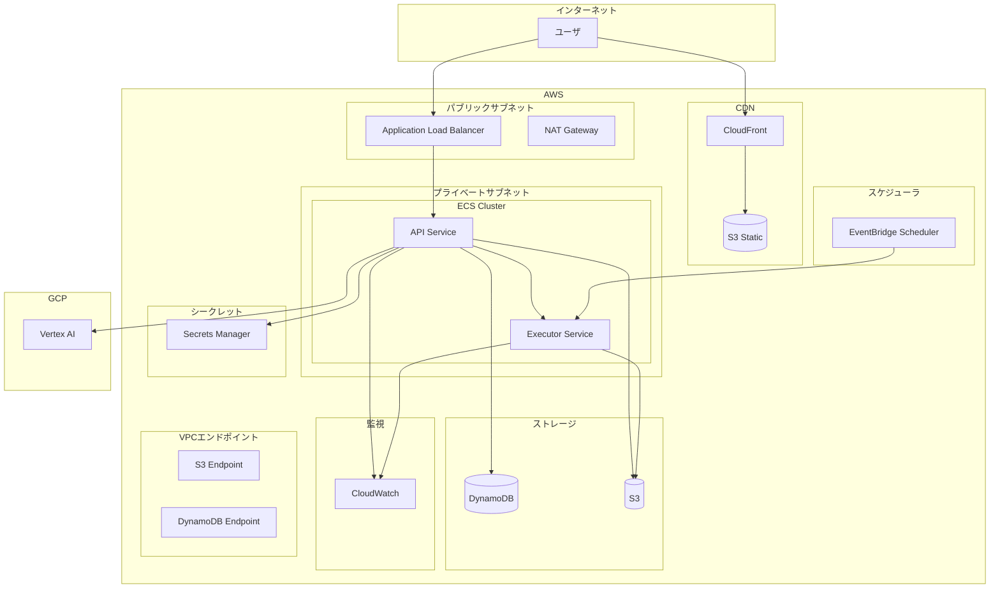

# 社内BI・Pythonカード デプロイメントガイド v0.2

Last Updated: 2026-02-03

## 1. 環境構成

### 1.1 環境一覧

| 環境 | 用途 | URL |
|------|------|-----|
| local | 開発 | http://localhost:3000 |
| staging | 検証 | https://bi-staging.internal.company.com |
| production | 本番 | https://bi.internal.company.com |

### 1.2 AWS構成図



---

## 2. ローカル開発環境

### 2.1 前提条件

- Docker 24.x以上
- docker-compose 2.x以上
- Node.js 20.x（フロントエンド開発）
- Python 3.11（バックエンド開発）

### 2.2 セットアップ

```bash
# リポジトリクローン
git clone https://github.com/company/bi-tool.git
cd bi-tool

# 環境変数ファイル作成
cp .env.example .env.local

# .env.local を編集
# JWT_SECRET_KEY=your-secret-key-min-32-chars-here
# VERTEX_AI_PROJECT_ID=your-gcp-project-id

# 起動
docker-compose up -d

# ログ確認
docker-compose logs -f
```

### 2.3 docker-compose.yml

```yaml
version: '3.8'

services:
  # フロントエンド
  frontend:
    build:
      context: ./frontend
      dockerfile: Dockerfile.dev
    ports:
      - "3000:3000"
    volumes:
      - ./frontend/src:/app/src
      - ./frontend/public:/app/public
    environment:
      - VITE_API_URL=http://localhost:8000
    depends_on:
      - api

  # API
  api:
    build:
      context: ./backend
      dockerfile: Dockerfile.dev
    ports:
      - "8000:8000"
    volumes:
      - ./backend/app:/app/app
    environment:
      - ENV=local
      - JWT_SECRET_KEY=${JWT_SECRET_KEY}
      - DYNAMODB_ENDPOINT=http://dynamodb-local:8000
      - S3_ENDPOINT=http://minio:9000
      - S3_ACCESS_KEY=minioadmin
      - S3_SECRET_KEY=minioadmin
      - S3_BUCKET_DATASETS=bi-datasets
      - EXECUTOR_ENDPOINT=http://executor:8080
      - VERTEX_AI_PROJECT_ID=${VERTEX_AI_PROJECT_ID}
      - GOOGLE_APPLICATION_CREDENTIALS=/app/secrets/gcp-sa.json
    volumes:
      - ./secrets:/app/secrets:ro
    depends_on:
      - dynamodb-local
      - minio
      - executor

  # Python実行基盤
  executor:
    build:
      context: ./executor
      dockerfile: Dockerfile
    ports:
      - "8080:8080"
    environment:
      - ENV=local
      - S3_ENDPOINT=http://minio:9000
      - S3_ACCESS_KEY=minioadmin
      - S3_SECRET_KEY=minioadmin
    depends_on:
      - minio

  # DynamoDB Local
  dynamodb-local:
    image: amazon/dynamodb-local:latest
    ports:
      - "8001:8000"
    command: "-jar DynamoDBLocal.jar -sharedDb -dbPath /data"
    volumes:
      - dynamodb-data:/data

  # MinIO (S3互換)
  minio:
    image: minio/minio:latest
    ports:
      - "9000:9000"
      - "9001:9001"
    environment:
      - MINIO_ROOT_USER=minioadmin
      - MINIO_ROOT_PASSWORD=minioadmin
    command: server /data --console-address ":9001"
    volumes:
      - minio-data:/data

  # MinIO初期設定
  minio-init:
    image: minio/mc:latest
    depends_on:
      - minio
    entrypoint: |
      /bin/sh -c "
      sleep 5
      mc alias set local http://minio:9000 minioadmin minioadmin
      mc mb local/bi-datasets --ignore-existing
      mc mb local/bi-static --ignore-existing
      exit 0
      "

  # DynamoDB テーブル初期化
  dynamodb-init:
    build:
      context: ./scripts
      dockerfile: Dockerfile.init
    environment:
      - DYNAMODB_ENDPOINT=http://dynamodb-local:8000
    depends_on:
      - dynamodb-local
    command: python init_tables.py

volumes:
  dynamodb-data:
  minio-data:
```

### 2.4 DynamoDBテーブル初期化スクリプト

`scripts/init_tables.py` で 8 テーブルを作成する（MVP 5 テーブル + FR-7 で追加された 3 テーブル）。

テーブル一覧:

| テーブル名 | PK | GSI | 用途 |
|------------|-----|-----|------|
| `bi_users` | `userId` | `UsersByEmail` (PK: email) | ユーザ管理 |
| `bi_datasets` | `datasetId` | `DatasetsByOwner` (PK: ownerId, SK: createdAt) | データセット |
| `bi_cards` | `cardId` | `CardsByOwner` (PK: ownerId, SK: createdAt) | カード |
| `bi_dashboards` | `dashboardId` | `DashboardsByOwner` (PK: ownerId, SK: createdAt) | ダッシュボード |
| `bi_filter_views` | `filterViewId` | `FilterViewsByDashboard` (PK: dashboardId, SK: createdAt) | フィルタビュー |
| `bi_groups` | `groupId` | `GroupsByName` (PK: name) | グループ管理 (FR-7) |
| `bi_group_members` | `groupId` + `userId` (複合キー) | `MembersByUser` (PK: userId, SK: groupId) | グループメンバー (FR-7) |
| `bi_dashboard_shares` | `shareId` | `SharesByDashboard` (PK: dashboardId, SK: createdAt), `SharesByTarget` (PK: sharedToId, SK: createdAt) | ダッシュボード共有 (FR-7) |

注意: 現在の `scripts/init_tables.py` は上位 5 テーブルのみ定義済み。FR-7 で追加された 3 テーブル (`bi_groups`, `bi_group_members`, `bi_dashboard_shares`) はリポジトリ層から参照されているが、init スクリプトへの追加は未完了。本番デプロイ前にスクリプト更新が必要。

```python
# scripts/init_tables.py
#!/usr/bin/env python3
"""DynamoDB テーブル初期化スクリプト (MVP版)"""
import boto3
import os
import time

DYNAMODB_ENDPOINT = os.environ.get('DYNAMODB_ENDPOINT', 'http://localhost:8000')
AWS_REGION = os.environ.get('AWS_REGION', 'ap-northeast-1')

dynamodb = boto3.resource(
    'dynamodb',
    endpoint_url=DYNAMODB_ENDPOINT,
    region_name=AWS_REGION,
    aws_access_key_id=os.environ.get('AWS_ACCESS_KEY_ID', 'dummy'),
    aws_secret_access_key=os.environ.get('AWS_SECRET_ACCESS_KEY', 'dummy'),
)

# MVP用テーブル定義 (5テーブル)
TABLES = [
    {
        'TableName': 'bi_users',
        'KeySchema': [{'AttributeName': 'userId', 'KeyType': 'HASH'}],
        'AttributeDefinitions': [
            {'AttributeName': 'userId', 'AttributeType': 'S'},
            {'AttributeName': 'email', 'AttributeType': 'S'},
        ],
        'GlobalSecondaryIndexes': [
            {
                'IndexName': 'UsersByEmail',
                'KeySchema': [{'AttributeName': 'email', 'KeyType': 'HASH'}],
                'Projection': {'ProjectionType': 'ALL'},
            },
        ],
    },
    {
        'TableName': 'bi_datasets',
        'KeySchema': [{'AttributeName': 'datasetId', 'KeyType': 'HASH'}],
        'AttributeDefinitions': [
            {'AttributeName': 'datasetId', 'AttributeType': 'S'},
            {'AttributeName': 'ownerId', 'AttributeType': 'S'},
            {'AttributeName': 'createdAt', 'AttributeType': 'N'},
        ],
        'GlobalSecondaryIndexes': [
            {
                'IndexName': 'DatasetsByOwner',
                'KeySchema': [
                    {'AttributeName': 'ownerId', 'KeyType': 'HASH'},
                    {'AttributeName': 'createdAt', 'KeyType': 'RANGE'},
                ],
                'Projection': {'ProjectionType': 'ALL'},
            },
        ],
    },
    {
        'TableName': 'bi_cards',
        'KeySchema': [{'AttributeName': 'cardId', 'KeyType': 'HASH'}],
        'AttributeDefinitions': [
            {'AttributeName': 'cardId', 'AttributeType': 'S'},
            {'AttributeName': 'ownerId', 'AttributeType': 'S'},
            {'AttributeName': 'createdAt', 'AttributeType': 'N'},
        ],
        'GlobalSecondaryIndexes': [
            {
                'IndexName': 'CardsByOwner',
                'KeySchema': [
                    {'AttributeName': 'ownerId', 'KeyType': 'HASH'},
                    {'AttributeName': 'createdAt', 'KeyType': 'RANGE'},
                ],
                'Projection': {'ProjectionType': 'ALL'},
            },
        ],
    },
    {
        'TableName': 'bi_dashboards',
        'KeySchema': [{'AttributeName': 'dashboardId', 'KeyType': 'HASH'}],
        'AttributeDefinitions': [
            {'AttributeName': 'dashboardId', 'AttributeType': 'S'},
            {'AttributeName': 'ownerId', 'AttributeType': 'S'},
            {'AttributeName': 'createdAt', 'AttributeType': 'N'},
        ],
        'GlobalSecondaryIndexes': [
            {
                'IndexName': 'DashboardsByOwner',
                'KeySchema': [
                    {'AttributeName': 'ownerId', 'KeyType': 'HASH'},
                    {'AttributeName': 'createdAt', 'KeyType': 'RANGE'},
                ],
                'Projection': {'ProjectionType': 'ALL'},
            },
        ],
    },
    {
        'TableName': 'bi_filter_views',
        'KeySchema': [{'AttributeName': 'filterViewId', 'KeyType': 'HASH'}],
        'AttributeDefinitions': [
            {'AttributeName': 'filterViewId', 'AttributeType': 'S'},
            {'AttributeName': 'dashboardId', 'AttributeType': 'S'},
            {'AttributeName': 'createdAt', 'AttributeType': 'N'},
        ],
        'GlobalSecondaryIndexes': [
            {
                'IndexName': 'FilterViewsByDashboard',
                'KeySchema': [
                    {'AttributeName': 'dashboardId', 'KeyType': 'HASH'},
                    {'AttributeName': 'createdAt', 'KeyType': 'RANGE'},
                ],
                'Projection': {'ProjectionType': 'ALL'},
            },
        ],
    },
    # --- FR-7 追加テーブル (3テーブル) ---
    {
        'TableName': 'bi_groups',
        'KeySchema': [{'AttributeName': 'groupId', 'KeyType': 'HASH'}],
        'AttributeDefinitions': [
            {'AttributeName': 'groupId', 'AttributeType': 'S'},
            {'AttributeName': 'name', 'AttributeType': 'S'},
        ],
        'GlobalSecondaryIndexes': [
            {
                'IndexName': 'GroupsByName',
                'KeySchema': [{'AttributeName': 'name', 'KeyType': 'HASH'}],
                'Projection': {'ProjectionType': 'ALL'},
            },
        ],
    },
    {
        'TableName': 'bi_group_members',
        'KeySchema': [
            {'AttributeName': 'groupId', 'KeyType': 'HASH'},
            {'AttributeName': 'userId', 'KeyType': 'RANGE'},
        ],
        'AttributeDefinitions': [
            {'AttributeName': 'groupId', 'AttributeType': 'S'},
            {'AttributeName': 'userId', 'AttributeType': 'S'},
        ],
        'GlobalSecondaryIndexes': [
            {
                'IndexName': 'MembersByUser',
                'KeySchema': [
                    {'AttributeName': 'userId', 'KeyType': 'HASH'},
                    {'AttributeName': 'groupId', 'KeyType': 'RANGE'},
                ],
                'Projection': {'ProjectionType': 'ALL'},
            },
        ],
    },
    {
        'TableName': 'bi_dashboard_shares',
        'KeySchema': [{'AttributeName': 'shareId', 'KeyType': 'HASH'}],
        'AttributeDefinitions': [
            {'AttributeName': 'shareId', 'AttributeType': 'S'},
            {'AttributeName': 'dashboardId', 'AttributeType': 'S'},
            {'AttributeName': 'sharedToId', 'AttributeType': 'S'},
            {'AttributeName': 'createdAt', 'AttributeType': 'N'},
        ],
        'GlobalSecondaryIndexes': [
            {
                'IndexName': 'SharesByDashboard',
                'KeySchema': [
                    {'AttributeName': 'dashboardId', 'KeyType': 'HASH'},
                    {'AttributeName': 'createdAt', 'KeyType': 'RANGE'},
                ],
                'Projection': {'ProjectionType': 'ALL'},
            },
            {
                'IndexName': 'SharesByTarget',
                'KeySchema': [
                    {'AttributeName': 'sharedToId', 'KeyType': 'HASH'},
                    {'AttributeName': 'createdAt', 'KeyType': 'RANGE'},
                ],
                'Projection': {'ProjectionType': 'ALL'},
            },
        ],
    },
]

def create_tables():
    """テーブルを作成"""
    # DynamoDBが起動するまで待機
    max_retries = 30
    for i in range(max_retries):
        try:
            list(dynamodb.tables.all())
            print("DynamoDB接続成功")
            break
        except Exception as e:
            if i == max_retries - 1:
                raise
            print(f"DynamoDB接続待機中... ({i+1}/{max_retries})")
            time.sleep(2)

    existing_tables = [t.name for t in dynamodb.tables.all()]

    for table_def in TABLES:
        table_name = table_def['TableName']

        if table_name in existing_tables:
            print(f"テーブル {table_name} は既に存在します。スキップします。")
            continue

        # BillingMode を追加
        create_params = {
            **table_def,
            'BillingMode': 'PAY_PER_REQUEST',
        }

        print(f"テーブル {table_name} を作成中...")
        dynamodb.create_table(**create_params)
        print(f"テーブル {table_name} を作成しました。")

if __name__ == '__main__':
    try:
        create_tables()
        print("\n全てのテーブル作成が完了しました。")
    except Exception as e:
        print(f"\nエラー: {e}")
        exit(1)
```

---

## 3. AWS インフラ構築（Terraform）

### 3.1 ディレクトリ構造

```
infra/
├── modules/
│   ├── networking/
│   │   ├── main.tf
│   │   ├── variables.tf
│   │   └── outputs.tf
│   ├── ecs/
│   │   ├── main.tf
│   │   ├── variables.tf
│   │   └── outputs.tf
│   ├── dynamodb/
│   │   ├── main.tf
│   │   ├── variables.tf
│   │   └── outputs.tf
│   ├── s3/
│   │   ├── main.tf
│   │   ├── variables.tf
│   │   └── outputs.tf
│   └── cloudfront/
│       ├── main.tf
│       ├── variables.tf
│       └── outputs.tf
├── environments/
│   ├── staging/
│   │   ├── main.tf
│   │   ├── variables.tf
│   │   └── terraform.tfvars
│   └── production/
│       ├── main.tf
│       ├── variables.tf
│       └── terraform.tfvars
└── README.md
```

### 3.2 VPCモジュール

```hcl
# infra/modules/networking/main.tf

resource "aws_vpc" "main" {
  cidr_block           = var.vpc_cidr
  enable_dns_hostnames = true
  enable_dns_support   = true

  tags = {
    Name = "${var.project}-${var.environment}-vpc"
  }
}

# パブリックサブネット
resource "aws_subnet" "public" {
  count                   = length(var.availability_zones)
  vpc_id                  = aws_vpc.main.id
  cidr_block              = cidrsubnet(var.vpc_cidr, 4, count.index)
  availability_zone       = var.availability_zones[count.index]
  map_public_ip_on_launch = true

  tags = {
    Name = "${var.project}-${var.environment}-public-${count.index + 1}"
  }
}

# プライベートサブネット
resource "aws_subnet" "private" {
  count             = length(var.availability_zones)
  vpc_id            = aws_vpc.main.id
  cidr_block        = cidrsubnet(var.vpc_cidr, 4, count.index + length(var.availability_zones))
  availability_zone = var.availability_zones[count.index]

  tags = {
    Name = "${var.project}-${var.environment}-private-${count.index + 1}"
  }
}

# インターネットゲートウェイ
resource "aws_internet_gateway" "main" {
  vpc_id = aws_vpc.main.id

  tags = {
    Name = "${var.project}-${var.environment}-igw"
  }
}

# NAT Gateway
resource "aws_eip" "nat" {
  domain = "vpc"

  tags = {
    Name = "${var.project}-${var.environment}-nat-eip"
  }
}

resource "aws_nat_gateway" "main" {
  allocation_id = aws_eip.nat.id
  subnet_id     = aws_subnet.public[0].id

  tags = {
    Name = "${var.project}-${var.environment}-nat"
  }
}

# S3 VPCエンドポイント
resource "aws_vpc_endpoint" "s3" {
  vpc_id            = aws_vpc.main.id
  service_name      = "com.amazonaws.${var.region}.s3"
  vpc_endpoint_type = "Gateway"
  route_table_ids   = [aws_route_table.private.id]

  tags = {
    Name = "${var.project}-${var.environment}-s3-endpoint"
  }
}

# DynamoDB VPCエンドポイント
resource "aws_vpc_endpoint" "dynamodb" {
  vpc_id            = aws_vpc.main.id
  service_name      = "com.amazonaws.${var.region}.dynamodb"
  vpc_endpoint_type = "Gateway"
  route_table_ids   = [aws_route_table.private.id]

  tags = {
    Name = "${var.project}-${var.environment}-dynamodb-endpoint"
  }
}
```

### 3.3 ECSモジュール

```hcl
# infra/modules/ecs/main.tf

# ECSクラスタ
resource "aws_ecs_cluster" "main" {
  name = "${var.project}-${var.environment}"

  setting {
    name  = "containerInsights"
    value = "enabled"
  }

  tags = {
    Name = "${var.project}-${var.environment}-cluster"
  }
}

# APIタスク定義
resource "aws_ecs_task_definition" "api" {
  family                   = "${var.project}-${var.environment}-api"
  network_mode             = "awsvpc"
  requires_compatibilities = ["FARGATE"]
  cpu                      = var.api_cpu
  memory                   = var.api_memory
  execution_role_arn       = aws_iam_role.ecs_execution.arn
  task_role_arn            = aws_iam_role.api_task.arn

  container_definitions = jsonencode([
    {
      name  = "api"
      image = "${var.ecr_repository_url}/api:${var.api_image_tag}"
      
      portMappings = [
        {
          containerPort = 8000
          hostPort      = 8000
          protocol      = "tcp"
        }
      ]
      
      environment = [
        { name = "ENV", value = var.environment },
        { name = "AWS_REGION", value = var.region },
        { name = "S3_BUCKET_DATASETS", value = var.s3_bucket_datasets },
        { name = "EXECUTOR_ENDPOINT", value = "http://${aws_service_discovery_service.executor.name}.${aws_service_discovery_private_dns_namespace.main.name}:8080" },
      ]
      
      secrets = [
        {
          name      = "JWT_SECRET_KEY"
          valueFrom = "${var.secrets_arn}:JWT_SECRET_KEY::"
        },
        {
          name      = "VERTEX_AI_PROJECT_ID"
          valueFrom = "${var.secrets_arn}:VERTEX_AI_PROJECT_ID::"
        },
      ]
      
      logConfiguration = {
        logDriver = "awslogs"
        options = {
          "awslogs-group"         = aws_cloudwatch_log_group.api.name
          "awslogs-region"        = var.region
          "awslogs-stream-prefix" = "api"
        }
      }
    }
  ])
}

# Executorタスク定義
resource "aws_ecs_task_definition" "executor" {
  family                   = "${var.project}-${var.environment}-executor"
  network_mode             = "awsvpc"
  requires_compatibilities = ["FARGATE"]
  cpu                      = var.executor_cpu
  memory                   = var.executor_memory
  execution_role_arn       = aws_iam_role.ecs_execution.arn
  task_role_arn            = aws_iam_role.executor_task.arn

  container_definitions = jsonencode([
    {
      name  = "executor"
      image = "${var.ecr_repository_url}/executor:${var.executor_image_tag}"
      
      portMappings = [
        {
          containerPort = 8080
          hostPort      = 8080
          protocol      = "tcp"
        }
      ]
      
      # 読み取り専用ファイルシステム
      readonlyRootFilesystem = true
      
      # 非rootユーザ
      user = "executor"
      
      # Capabilities削除
      linuxParameters = {
        capabilities = {
          drop = ["ALL"]
        }
      }
      
      mountPoints = [
        {
          sourceVolume  = "tmp"
          containerPath = "/tmp"
          readOnly      = false
        }
      ]
      
      environment = [
        { name = "ENV", value = var.environment },
        { name = "AWS_REGION", value = var.region },
        { name = "S3_BUCKET_DATASETS", value = var.s3_bucket_datasets },
      ]
      
      logConfiguration = {
        logDriver = "awslogs"
        options = {
          "awslogs-group"         = aws_cloudwatch_log_group.executor.name
          "awslogs-region"        = var.region
          "awslogs-stream-prefix" = "executor"
        }
      }
    }
  ])

  volume {
    name = "tmp"
  }
}

# Executorセキュリティグループ（外部通信遮断）
resource "aws_security_group" "executor" {
  name        = "${var.project}-${var.environment}-executor-sg"
  description = "Security group for executor - no external access"
  vpc_id      = var.vpc_id

  # インバウンド: APIからのみ
  ingress {
    from_port       = 8080
    to_port         = 8080
    protocol        = "tcp"
    security_groups = [aws_security_group.api.id]
  }

  # アウトバウンド: S3 VPCエンドポイントのみ
  egress {
    from_port       = 443
    to_port         = 443
    protocol        = "tcp"
    prefix_list_ids = [var.s3_endpoint_prefix_list_id]
  }

  tags = {
    Name = "${var.project}-${var.environment}-executor-sg"
  }
}
```

### 3.4 デプロイコマンド

```bash
# infra/environments/staging にて

# 初期化
terraform init

# プラン確認
terraform plan -var-file=terraform.tfvars

# 適用
terraform apply -var-file=terraform.tfvars

# 確認
terraform output
```

---

## 4. CI/CD パイプライン

### 4.1 GitHub Actions

```yaml
# .github/workflows/ci.yml
name: CI

on:
  push:
    branches: [main, develop]
  pull_request:
    branches: [main, develop]

jobs:
  # バックエンドテスト
  backend-test:
    runs-on: ubuntu-latest
    defaults:
      run:
        working-directory: backend
    
    steps:
      - uses: actions/checkout@v4
      
      - name: Set up Python
        uses: actions/setup-python@v5
        with:
          python-version: '3.11'
          cache: 'pip'
      
      - name: Install dependencies
        run: pip install -r requirements.txt -r requirements-dev.txt
      
      - name: Run linter
        run: ruff check app/
      
      - name: Run type check
        run: mypy app/
      
      - name: Run tests
        run: pytest tests/ --cov=app --cov-report=xml
      
      - name: Upload coverage
        uses: codecov/codecov-action@v3
        with:
          files: ./backend/coverage.xml

  # フロントエンドテスト
  frontend-test:
    runs-on: ubuntu-latest
    defaults:
      run:
        working-directory: frontend
    
    steps:
      - uses: actions/checkout@v4
      
      - name: Set up Node.js
        uses: actions/setup-node@v4
        with:
          node-version: '20'
          cache: 'npm'
          cache-dependency-path: frontend/package-lock.json
      
      - name: Install dependencies
        run: npm ci
      
      - name: Run linter
        run: npm run lint
      
      - name: Run type check
        run: npm run typecheck
      
      - name: Run tests
        run: npm run test -- --coverage
      
      - name: Upload coverage
        uses: codecov/codecov-action@v3
        with:
          files: ./frontend/coverage/lcov.info

  # Dockerビルド
  build:
    needs: [backend-test, frontend-test]
    runs-on: ubuntu-latest
    if: github.ref == 'refs/heads/main' || github.ref == 'refs/heads/develop'
    
    steps:
      - uses: actions/checkout@v4
      
      - name: Configure AWS credentials
        uses: aws-actions/configure-aws-credentials@v4
        with:
          aws-access-key-id: ${{ secrets.AWS_ACCESS_KEY_ID }}
          aws-secret-access-key: ${{ secrets.AWS_SECRET_ACCESS_KEY }}
          aws-region: ap-northeast-1
      
      - name: Login to Amazon ECR
        id: login-ecr
        uses: aws-actions/amazon-ecr-login@v2
      
      - name: Build and push API image
        env:
          ECR_REGISTRY: ${{ steps.login-ecr.outputs.registry }}
          IMAGE_TAG: ${{ github.sha }}
        run: |
          docker build -t $ECR_REGISTRY/bi-api:$IMAGE_TAG ./backend
          docker push $ECR_REGISTRY/bi-api:$IMAGE_TAG
      
      - name: Build and push Executor image
        env:
          ECR_REGISTRY: ${{ steps.login-ecr.outputs.registry }}
          IMAGE_TAG: ${{ github.sha }}
        run: |
          docker build -t $ECR_REGISTRY/bi-executor:$IMAGE_TAG ./executor
          docker push $ECR_REGISTRY/bi-executor:$IMAGE_TAG
      
      - name: Build and push Frontend image
        env:
          ECR_REGISTRY: ${{ steps.login-ecr.outputs.registry }}
          IMAGE_TAG: ${{ github.sha }}
        run: |
          docker build -t $ECR_REGISTRY/bi-frontend:$IMAGE_TAG ./frontend
          docker push $ECR_REGISTRY/bi-frontend:$IMAGE_TAG
```

### 4.2 デプロイワークフロー

```yaml
# .github/workflows/deploy.yml
name: Deploy

on:
  workflow_dispatch:
    inputs:
      environment:
        description: 'Environment to deploy'
        required: true
        type: choice
        options:
          - staging
          - production
      image_tag:
        description: 'Image tag to deploy'
        required: true

jobs:
  deploy:
    runs-on: ubuntu-latest
    environment: ${{ github.event.inputs.environment }}
    
    steps:
      - uses: actions/checkout@v4
      
      - name: Configure AWS credentials
        uses: aws-actions/configure-aws-credentials@v4
        with:
          aws-access-key-id: ${{ secrets.AWS_ACCESS_KEY_ID }}
          aws-secret-access-key: ${{ secrets.AWS_SECRET_ACCESS_KEY }}
          aws-region: ap-northeast-1
      
      - name: Deploy API service
        run: |
          aws ecs update-service \
            --cluster bi-${{ github.event.inputs.environment }} \
            --service api \
            --force-new-deployment \
            --task-definition $(aws ecs register-task-definition \
              --cli-input-json file://ecs/api-task-definition.json \
              --query 'taskDefinition.taskDefinitionArn' \
              --output text)
      
      - name: Deploy Executor service
        run: |
          aws ecs update-service \
            --cluster bi-${{ github.event.inputs.environment }} \
            --service executor \
            --force-new-deployment \
            --task-definition $(aws ecs register-task-definition \
              --cli-input-json file://ecs/executor-task-definition.json \
              --query 'taskDefinition.taskDefinitionArn' \
              --output text)
      
      - name: Deploy Frontend to S3
        run: |
          aws s3 sync ./frontend/dist s3://bi-static-${{ github.event.inputs.environment }}/ --delete
          aws cloudfront create-invalidation \
            --distribution-id ${{ secrets.CLOUDFRONT_DISTRIBUTION_ID }} \
            --paths "/*"
      
      - name: Wait for deployment
        run: |
          aws ecs wait services-stable \
            --cluster bi-${{ github.event.inputs.environment }} \
            --services api executor
      
      - name: Notify deployment
        uses: slackapi/slack-github-action@v1
        with:
          channel-id: ${{ secrets.SLACK_CHANNEL_ID }}
          slack-message: |
            :rocket: Deployed to ${{ github.event.inputs.environment }}
            Image: ${{ github.event.inputs.image_tag }}
            Actor: ${{ github.actor }}
```

---

## 5. 運用手順

### 5.1 ログ確認

```bash
# CloudWatch Logs
aws logs tail /ecs/bi-production-api --follow

# 特定期間のログ検索
aws logs filter-log-events \
  --log-group-name /ecs/bi-production-api \
  --start-time $(date -d '1 hour ago' +%s)000 \
  --filter-pattern "ERROR"
```

### 5.2 メトリクス確認

```bash
# ECSサービスのメトリクス
aws cloudwatch get-metric-statistics \
  --namespace AWS/ECS \
  --metric-name CPUUtilization \
  --dimensions Name=ClusterName,Value=bi-production Name=ServiceName,Value=api \
  --start-time $(date -d '1 hour ago' -u +%Y-%m-%dT%H:%M:%SZ) \
  --end-time $(date -u +%Y-%m-%dT%H:%M:%SZ) \
  --period 300 \
  --statistics Average
```

### 5.3 ロールバック

```bash
# 前のタスク定義に戻す
aws ecs update-service \
  --cluster bi-production \
  --service api \
  --task-definition bi-production-api:123  # 前のリビジョン番号
```

### 5.4 スケーリング

```bash
# サービスのタスク数を変更
aws ecs update-service \
  --cluster bi-production \
  --service api \
  --desired-count 4
```

---

## 6. バックアップ・リカバリ

### 6.1 DynamoDB

- Point-in-time Recovery（PITR）を有効化
- 35日間のバックアップを保持

```hcl
resource "aws_dynamodb_table" "dashboards" {
  # ...
  
  point_in_time_recovery {
    enabled = true
  }
}
```

### 6.2 S3

- バージョニングを有効化
- ライフサイクルルールで古いバージョンを削除

```hcl
resource "aws_s3_bucket_versioning" "datasets" {
  bucket = aws_s3_bucket.datasets.id
  versioning_configuration {
    status = "Enabled"
  }
}

resource "aws_s3_bucket_lifecycle_configuration" "datasets" {
  bucket = aws_s3_bucket.datasets.id

  rule {
    id     = "delete-old-versions"
    status = "Enabled"

    noncurrent_version_expiration {
      noncurrent_days = 30
    }
  }
}
```

### 6.3 リカバリ手順

```bash
# DynamoDB テーブルをPITRから復元
aws dynamodb restore-table-to-point-in-time \
  --source-table-name bi_dashboards \
  --target-table-name bi_dashboards_restored \
  --restore-date-time 2024-01-15T10:00:00Z

# S3 オブジェクトの特定バージョンを復元
aws s3api get-object \
  --bucket bi-datasets-production \
  --key datasets/ds_abc123/data/part-0000.parquet \
  --version-id "xxxxx" \
  restored-file.parquet
```

---

## 7. トラブルシューティング

### 7.1 よくある問題

| 問題 | 原因 | 対処 |
|------|------|------|
| カード実行タイムアウト | データ量が多い、コードが非効率 | パーティション活用、コード最適化 |
| メモリ不足エラー | 大量データの読み込み | チャンク処理、サンプリング |
| 権限エラー | IAMロール設定不備 | タスクロールの確認 |
| 接続エラー | VPCエンドポイント設定不備 | セキュリティグループ確認 |

### 7.2 デバッグコマンド

```bash
# ECSタスクの状態確認
aws ecs describe-tasks \
  --cluster bi-production \
  --tasks arn:aws:ecs:ap-northeast-1:123456789:task/bi-production/xxxxx

# コンテナへの接続（ECS Exec）
aws ecs execute-command \
  --cluster bi-production \
  --task xxxxx \
  --container api \
  --interactive \
  --command "/bin/sh"
```
