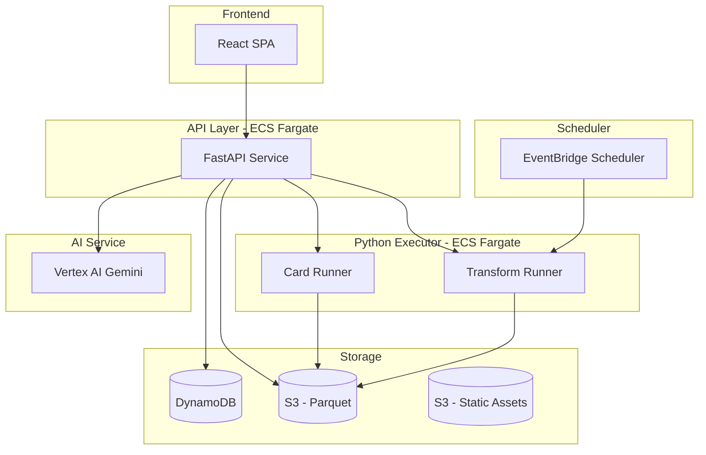

# 社内BI・Pythonカード 設計書 v0.2

## 1. アーキテクチャ概要

### 1.1 システム構成



### 1.2 コンポーネント責務

**フロントエンド（React SPA）**
- ダッシュボードUI
- フィルタ操作
- 共有/権限UI
- Chatbot UI
- カードのiframe表示

**API層（FastAPI）**
- Dataset取り込みオーケストレーション
- Dashboard/Card/Transform/FilterViewのCRUD
- カード実行のオーケストレーション
- フィルタ適用ロジック
- 共有/権限チェック
- Chatbot連携（Vertex AI API呼び出し）

**Python実行基盤（ECS Fargate）**
- Card実行（サンドボックス環境）
- Transform実行（サンドボックス環境）
- 外部ネットワーク遮断
- リソース制限
- 実行キュー管理

**ストレージ**
- DynamoDB: メタデータ（Dataset/Card/Dashboard等の定義）
- S3: Dataset Parquet形式、静的アセット（JS/CSS）

**スケジューラ**
- EventBridge Scheduler: Transformのスケジュール実行

**AIサービス**
- Vertex AI: Chatbot機能

### 1.3 データフロー

**Dataset取り込みフロー:**
```
CSV (Local/S3) → API → Parquet変換 → S3保存 → DynamoDBメタデータ登録
```

**カード実行フロー:**
```
Dashboard閲覧 → フィルタ変更 → API → フィルタ適用 → 実行基盤 → HTML生成 → iframe表示
```

**Transform実行フロー:**
```
Transform定義 → 手動実行/スケジュール → 実行基盤 → 入力Dataset読み込み → 変換 → 出力Dataset保存
```

**Chatbotフロー:**
```
ユーザ質問 → API → Datasetサマリ生成 → Vertex AI → 回答 → UI表示
```

---

## 2. データモデル

### 2.1 DynamoDBテーブル設計

#### Users テーブル

| 属性名 | 型 | 説明 |
|--------|-----|------|
| userId | String (PK) | ユーザID |
| email | String | メールアドレス |
| name | String | 表示名 |
| createdAt | Number | 作成日時（Unix timestamp） |
| updatedAt | Number | 更新日時 |

#### Groups テーブル

| 属性名 | 型 | 説明 |
|--------|-----|------|
| groupId | String (PK) | グループID |
| name | String | グループ名 |
| createdAt | Number | 作成日時 |
| updatedAt | Number | 更新日時 |

**GSI: GroupMembers**
- PK: groupId
- SK: userId
- 用途: グループのメンバー一覧取得

#### Datasets テーブル

| 属性名 | 型 | 説明 |
|--------|-----|------|
| datasetId | String (PK) | Dataset ID |
| name | String | Dataset名 |
| ownerId | String | 所有者ユーザID |
| sourceType | String | Local CSV / S3 CSV / Transform |
| sourceConfig | Map | ソース設定（S3バケット/パス等） |
| schema | List | スキーマ情報（列名、型） |
| rowCount | Number | 行数 |
| columnCount | Number | 列数 |
| s3Path | String | S3上のParquetファイルパス |
| partitionColumn | String | パーティションカラム（日付） |
| createdAt | Number | 作成日時 |
| updatedAt | Number | 更新日時 |
| lastImportAt | Number | 最終取り込み日時 |
| lastImportBy | String | 最終取り込み実行者 |

**GSI: DatasetsByOwner**
- PK: ownerId
- SK: createdAt
- 用途: 所有者別Dataset一覧取得

#### Transforms テーブル

| 属性名 | 型 | 説明 |
|--------|-----|------|
| transformId | String (PK) | Transform ID |
| name | String | Transform名 |
| ownerId | String | 所有者ユーザID |
| inputDatasetIds | List | 入力Dataset IDリスト |
| outputDatasetId | String | 出力Dataset ID |
| code | String | Pythonコード |
| schedule | String | cron形式スケジュール（任意） |
| createdAt | Number | 作成日時 |
| updatedAt | Number | 更新日時 |

**GSI: TransformsByOwner**
- PK: ownerId
- SK: createdAt
- 用途: 所有者別Transform一覧取得

#### Cards テーブル

| 属性名 | 型 | 説明 |
|--------|-----|------|
| cardId | String (PK) | Card ID |
| name | String | Card名 |
| ownerId | String | 所有者ユーザID |
| datasetId | String | 参照Dataset ID |
| code | String | Pythonコード |
| params | Map | カード固有パラメータ |
| usedColumns | List | 利用カラム一覧（メタ情報） |
| filterApplicable | List | 対応フィルタ項目（メタ情報） |
| createdAt | Number | 作成日時 |
| updatedAt | Number | 更新日時 |

**GSI: CardsByOwner**
- PK: ownerId
- SK: createdAt
- 用途: 所有者別Card一覧取得

#### Dashboards テーブル

| 属性名 | 型 | 説明 |
|--------|-----|------|
| dashboardId | String (PK) | Dashboard ID |
| name | String | Dashboard名 |
| ownerId | String | 所有者ユーザID |
| layout | Map | レイアウト情報（カード配置） |
| filters | List | ページフィルタ定義 |
| defaultFilterViewId | String | デフォルトFilterView ID（任意） |
| createdAt | Number | 作成日時 |
| updatedAt | Number | 更新日時 |

**GSI: DashboardsByOwner**
- PK: ownerId
- SK: createdAt
- 用途: 所有者別Dashboard一覧取得

**GSI: DashboardsBySharedUser**
- PK: sharedUserId
- SK: dashboardId
- 用途: 共有されたDashboard一覧取得

**GSI: DashboardsBySharedGroup**
- PK: sharedGroupId
- SK: dashboardId
- 用途: グループ共有されたDashboard一覧取得

#### DashboardShares テーブル

| 属性名 | 型 | 説明 |
|--------|-----|------|
| shareId | String (PK) | Share ID |
| dashboardId | String | Dashboard ID |
| sharedToType | String | User / Group |
| sharedToId | String | 共有先ID（userId or groupId） |
| permission | String | Owner / Editor / Viewer |
| sharedBy | String | 共有実行者ユーザID |
| createdAt | Number | 作成日時 |

**GSI: SharesByDashboard**
- PK: dashboardId
- SK: createdAt
- 用途: Dashboardの共有一覧取得

#### FilterViews テーブル

| 属性名 | 型 | 説明 |
|--------|-----|------|
| filterViewId | String (PK) | FilterView ID |
| dashboardId | String | Dashboard ID |
| name | String | FilterView名 |
| ownerId | String | 所有者ユーザID |
| filterState | Map | フィルタ状態 |
| isShared | Boolean | 共有ビューか |
| isDefault | Boolean | デフォルトビューか |
| createdAt | Number | 作成日時 |
| updatedAt | Number | 更新日時 |

**GSI: FilterViewsByDashboard**
- PK: dashboardId
- SK: createdAt
- 用途: DashboardのFilterView一覧取得

#### AuditLogs テーブル

| 属性名 | 型 | 説明 |
|--------|-----|------|
| logId | String (PK) | Log ID |
| timestamp | Number | ログ日時（Unix timestamp） |
| eventType | String | イベント種別 |
| userId | String | 実行者ユーザID |
| targetType | String | 対象オブジェクト種別 |
| targetId | String | 対象オブジェクトID |
| details | Map | 詳細情報 |

**GSI: LogsByTimestamp**
- PK: timestamp (日付パーティション)
- SK: logId
- 用途: 時系列ログ検索

**GSI: LogsByTarget**
- PK: targetId
- SK: timestamp
- 用途: 対象別ログ検索

### 2.2 S3ストレージ構造

```
s3://{bucket}/
  datasets/
    {datasetId}/
      data.parquet              # Parquet形式データ
      partitions/               # パーティション（日付別）
        {date}/
          part-*.parquet
  static/
    js/
      plotly-{version}.js       # Plotly等の許可JSライブラリ
    css/
      plotly-{version}.css
```

**Parquet形式の利点:**
- 列指向フォーマットでクエリ効率が高い
- 圧縮率が高い
- パーティションでプルーニング可能

---

## 3. API設計

### 3.1 認証/認可

**認証方式:**
- MVP: セッションベース（JWT）
- V1以降: OIDC（IdP連携）

**認可チェック:**
- Dashboard閲覧: Viewer/Editor/Owner権限チェック
- Dashboard編集: Editor/Owner権限チェック
- Dashboard共有: Owner権限チェック
- Dataset/Card/Transform編集: ownerチェック

### 3.2 エンドポイント一覧

#### 認証

- `POST /api/auth/login` - ログイン
- `POST /api/auth/logout` - ログアウト
- `GET /api/auth/me` - 現在のユーザ情報取得

#### Users

- `GET /api/users` - ユーザ一覧取得
- `GET /api/users/{userId}` - ユーザ詳細取得

#### Groups

- `GET /api/groups` - グループ一覧取得
- `POST /api/groups` - グループ作成
- `GET /api/groups/{groupId}` - グループ詳細取得
- `PUT /api/groups/{groupId}` - グループ更新
- `DELETE /api/groups/{groupId}` - グループ削除
- `POST /api/groups/{groupId}/members` - メンバー追加
- `DELETE /api/groups/{groupId}/members/{userId}` - メンバー削除

#### Datasets

- `GET /api/datasets` - Dataset一覧取得
- `POST /api/datasets` - Dataset作成（Local CSV取り込み）
- `GET /api/datasets/{datasetId}` - Dataset詳細取得
- `PUT /api/datasets/{datasetId}` - Dataset更新
- `DELETE /api/datasets/{datasetId}` - Dataset削除
- `POST /api/datasets/{datasetId}/import` - 再取り込み
- `POST /api/datasets/s3-import` - S3 CSV取り込み
- `GET /api/datasets/{datasetId}/preview` - プレビュー取得

#### Transforms

- `GET /api/transforms` - Transform一覧取得
- `POST /api/transforms` - Transform作成
- `GET /api/transforms/{transformId}` - Transform詳細取得
- `PUT /api/transforms/{transformId}` - Transform更新
- `DELETE /api/transforms/{transformId}` - Transform削除
- `POST /api/transforms/{transformId}/execute` - 手動実行
- `GET /api/transforms/{transformId}/executions` - 実行履歴取得

#### Cards

- `GET /api/cards` - Card一覧取得
- `POST /api/cards` - Card作成
- `GET /api/cards/{cardId}` - Card詳細取得
- `PUT /api/cards/{cardId}` - Card更新
- `DELETE /api/cards/{cardId}` - Card削除
- `POST /api/cards/{cardId}/preview` - プレビュー実行

#### Dashboards

- `GET /api/dashboards` - Dashboard一覧取得
- `POST /api/dashboards` - Dashboard作成
- `GET /api/dashboards/{dashboardId}` - Dashboard詳細取得
- `PUT /api/dashboards/{dashboardId}` - Dashboard更新
- `DELETE /api/dashboards/{dashboardId}` - Dashboard削除
- `POST /api/dashboards/{dashboardId}/clone` - Dashboard複製
- `GET /api/dashboards/{dashboardId}/referenced-datasets` - 参照Dataset一覧取得

#### Dashboard Shares

- `GET /api/dashboards/{dashboardId}/shares` - 共有一覧取得
- `POST /api/dashboards/{dashboardId}/shares` - 共有追加
- `PUT /api/dashboards/{dashboardId}/shares/{shareId}` - 共有更新
- `DELETE /api/dashboards/{dashboardId}/shares/{shareId}` - 共有削除

#### FilterViews

- `GET /api/dashboards/{dashboardId}/filter-views` - FilterView一覧取得
- `POST /api/dashboards/{dashboardId}/filter-views` - FilterView作成
- `GET /api/filter-views/{filterViewId}` - FilterView詳細取得
- `PUT /api/filter-views/{filterViewId}` - FilterView更新
- `DELETE /api/filter-views/{filterViewId}` - FilterView削除

#### Card Execution

- `POST /api/cards/{cardId}/execute` - カード実行（フィルタ適用済みデータを渡す）

#### Chatbot

- `POST /api/dashboards/{dashboardId}/chat` - Chatbot質問

#### Audit Logs

- `GET /api/audit-logs` - 監査ログ取得（管理者のみ）

### 3.3 エラーハンドリング

**エラー形式:**
```json
{
  "error": {
    "code": "ERROR_CODE",
    "message": "エラーメッセージ",
    "details": {}
  }
}
```

**主要エラーコード:**
- `UNAUTHORIZED`: 認証エラー
- `FORBIDDEN`: 権限エラー
- `NOT_FOUND`: リソース不存在
- `VALIDATION_ERROR`: バリデーションエラー
- `EXECUTION_TIMEOUT`: 実行タイムアウト
- `EXECUTION_ERROR`: 実行エラー

---

## 4. Python実行基盤設計

### 4.1 サンドボックス実装方式

**コンテナベース分離:**
- ECS Fargateタスクとして実行
- 各実行は独立したコンテナインスタンス
- 実行終了後にコンテナ破棄

**ネットワーク分離:**
- VPCセキュリティグループで外部通信遮断
- S3/DynamoDBへのアクセスのみ許可（VPCエンドポイント経由）

**ファイルシステム:**
- 読み取り専用ルートファイルシステム
- 一時ディレクトリのみ書き込み可能
- 実行終了時にクリーンアップ

**ユーザ分離:**
- 非rootユーザで実行
- コンテナ内でユーザ分離は不要（コンテナ単位で分離）

### 4.2 リソース制限

**Card実行:**
- CPU: 1 vCPU
- メモリ: 2 GB
- タイムアウト: 10秒
- ディスク: 1 GB

**Transform実行:**
- CPU: 2 vCPU
- メモリ: 4 GB
- タイムアウト: 5分
- ディスク: 10 GB

### 4.3 ホワイトリストライブラリ管理

**許可ライブラリリスト（暫定）:**
- pandas
- pyarrow
- plotly
- numpy
- matplotlib
- seaborn

**実装方式:**
- Dockerイメージに許可ライブラリのみインストール
- importフックで動的チェック（追加の安全策）
- ライブラリバージョンは固定

### 4.4 実行キューとバックプレッシャ

**キュー管理:**
- RedisまたはDynamoDBでキュー管理
- 同時実行数上限: Card 10件、Transform 5件
- キューが満杯の場合、HTTP 503を返す

**実行フロー:**
```
API → キュー追加 → ワーカーが取得 → ECSタスク起動 → 実行 → 結果保存 → キューから削除
```

---

## 5. フロントエンド設計

### 5.1 画面一覧

1. **ログイン画面**
   - ユーザ名/パスワード入力

2. **Dashboard一覧画面**
   - Dashboard一覧表示
   - 作成/削除ボタン

3. **Dashboard閲覧画面**
   - カード表示（グリッドレイアウト）
   - フィルタバー
   - FilterView選択
   - Chatbotパネル（スライドイン）

4. **Dashboard編集画面**
   - カード追加/削除/移動/リサイズ
   - フィルタ設定
   - 共有設定

5. **Dataset管理画面**
   - Dataset一覧
   - 取り込み（Local/S3）
   - プレビュー
   - 再取り込み

6. **Transform管理画面**
   - Transform一覧
   - 作成/編集
   - 実行履歴
   - スケジュール設定

7. **Card管理画面**
   - Card一覧
   - 作成/編集
   - プレビュー

8. **ユーザ/グループ管理画面**
   - ユーザ一覧
   - グループ一覧
   - メンバー管理

### 5.2 コンポーネント構成

```
src/
  components/
    Dashboard/
      DashboardViewer.tsx      # 閲覧モード
      DashboardEditor.tsx      # 編集モード
      FilterBar.tsx            # フィルタバー
      CardContainer.tsx        # カードコンテナ（iframe）
      ChatbotPanel.tsx         # Chatbotパネル
    Dataset/
      DatasetList.tsx
      DatasetImport.tsx
      DatasetPreview.tsx
    Transform/
      TransformList.tsx
      TransformEditor.tsx
      TransformExecutionHistory.tsx
    Card/
      CardList.tsx
      CardEditor.tsx
      CardPreview.tsx
    Common/
      Layout.tsx
      Header.tsx
      Sidebar.tsx
```

### 5.3 状態管理

**状態管理ライブラリ:**
- React Query: サーバ状態管理
- Zustand: クライアント状態管理（フィルタ状態等）

**主要状態:**
- 認証状態
- 現在のDashboard
- フィルタ状態
- Chatbot会話履歴

### 5.4 iframe + CSP設計

**iframe実装:**
```tsx
<iframe
  sandbox="allow-scripts allow-same-origin"
  srcDoc={cardHtml}
  style={{ width: '100%', height: '100%', border: 'none' }}
/>
```

**CSP設定:**
```
Content-Security-Policy: 
  default-src 'self';
  script-src 'self' https://cdn.internal.company.com/plotly/;
  style-src 'self' 'unsafe-inline';
  img-src 'self' data:;
```

**許可JSライブラリ:**
- Plotly: 社内CDNから配信
- バージョン固定（例: plotly-2.26.0.js）

---

## 6. インフラ設計

### 6.1 AWS構成（本番）

**VPC構成:**
- パブリックサブネット: ALB
- プライベートサブネット: ECS Fargate（API/実行基盤）
- VPCエンドポイント: S3, DynamoDB

**ECS構成:**
- クラスタ: `bi-cluster`
- タスク定義:
  - `api-task`: FastAPIサービス
  - `executor-task`: Python実行基盤
- サービス:
  - `api-service`: APIサービス（ALB経由）
  - `executor-service`: 実行基盤（内部のみ）

**DynamoDB:**
- テーブル: 上記テーブル設計参照
- キャパシティモード: オンデマンド

**S3:**
- バケット: `bi-datasets-{env}`
- バケット: `bi-static-{env}`

**EventBridge:**
- Scheduler: Transformのスケジュール実行
- Rule: cron式でECSタスク起動

**CloudFront:**
- オリジン: S3（静的アセット）
- キャッシュポリシー: 静的コンテンツ

### 6.2 docker-compose構成（ローカル）

```yaml
version: '3.8'

services:
  api:
    build: ./backend
    ports:
      - "8000:8000"
    environment:
      - ENV=local
      - DYNAMODB_ENDPOINT=http://dynamodb-local:8000
      - S3_ENDPOINT=http://minio:9000
      - S3_ACCESS_KEY=minioadmin
      - S3_SECRET_KEY=minioadmin
    depends_on:
      - dynamodb-local
      - minio

  executor:
    build: ./executor
    environment:
      - ENV=local
      - S3_ENDPOINT=http://minio:9000
      - S3_ACCESS_KEY=minioadmin
      - S3_SECRET_KEY=minioadmin
    depends_on:
      - minio

  frontend:
    build: ./frontend
    ports:
      - "3000:3000"
    environment:
      - REACT_APP_API_URL=http://localhost:8000
    depends_on:
      - api

  dynamodb-local:
    image: amazon/dynamodb-local
    ports:
      - "8000:8000"
    command: "-jar DynamoDBLocal.jar -sharedDb"

  minio:
    image: minio/minio
    ports:
      - "9000:9000"
      - "9001:9001"
    environment:
      - MINIO_ROOT_USER=minioadmin
      - MINIO_ROOT_PASSWORD=minioadmin
    command: server /data --console-address ":9001"
```

### 6.3 環境変数による切り替え

**環境変数:**
- `ENV`: local / staging / production
- `DYNAMODB_ENDPOINT`: DynamoDBエンドポイント（local時はDynamoDB Local）
- `S3_ENDPOINT`: S3エンドポイント（local時はMinIO）
- `S3_ACCESS_KEY`: S3アクセスキー
- `S3_SECRET_KEY`: S3シークレットキー
- `VERTEX_AI_PROJECT_ID`: Vertex AIプロジェクトID
- `VERTEX_AI_LOCATION`: Vertex AIリージョン

---

## 7. Chatbot設計

### 7.1 Vertex AI連携方式

**API使用:**
- Vertex AI Gemini API（REST）
- プロジェクトIDとリージョンで認証

**認証:**
- サービスアカウントキー（JSON）
- 環境変数で設定

### 7.2 プロンプト設計

**プロンプト構造:**
```
あなたはデータ分析の専門家です。以下のDataset情報を基に、ユーザの質問に回答してください。

Dataset情報:
- 名前: {datasetName}
- スキーマ: {schema}
- サンプルデータ: {sampleRows}
- 統計情報: {statistics}

ユーザ質問: {userQuestion}

回答は簡潔に、データに基づいた内容でお願いします。
```

**Datasetサマリ生成:**
- スキーマ: 列名、型、NULL許容
- サンプルデータ: 先頭10行
- 統計情報: 行数、列数、各列の基本統計（数値列: min/max/mean、カテゴリ列: ユニーク数）

**大規模Dataset対応:**
- 100万行の場合は全行送信不可
- サンプリング（ランダム1000行）または集計結果を送信

### 7.3 レート制限

**制限:**
- ユーザあたり1分間に5リクエスト
- Dashboardあたり1分間に10リクエスト

**実装:**
- RedisまたはDynamoDBでレート制限管理
- 超過時はHTTP 429を返す

### 7.4 UI設計

**Chatbotパネル:**
- Dashboard閲覧画面の右側にスライドイン
- 会話履歴表示
- 入力フォーム
- ローディング状態表示

**会話履歴:**
- セッション単位で保持
- ページリロードでリセット
- 将来的には保存機能（V1以降）

---

## 8. セキュリティ設計

### 8.1 Python実行セキュリティ

**ネットワーク層:**
- VPCセキュリティグループで外部通信遮断
- S3/DynamoDBへのアクセスのみ許可（VPCエンドポイント）

**コンテナ層:**
- リソース制限（CPU/メモリ/タイムアウト）
- 読み取り専用ファイルシステム
- 非rootユーザ実行

**コード層:**
- ホワイトリストライブラリ
- importフックで動的チェック

### 8.2 HTML表示セキュリティ

**iframe分離:**
- sandbox属性で権限制限
- allow-scripts, allow-same-originのみ許可

**CSP:**
- デフォルトで'self'のみ許可
- 許可JSライブラリは社内CDNから配信
- 任意スクリプト禁止

### 8.3 認証/認可セキュリティ

**認証:**
- JWT（MVP）
- セッションタイムアウト: 24時間
- パスワードポリシー: 8文字以上、英数字記号

**認可:**
- Dashboard権限チェック（各APIエンドポイント）
- Dataset/Card/Transform編集はownerチェック

### 8.4 監査ログ

**記録対象:**
- Dashboard共有変更
- Dataset取り込み/Transform実行
- カード実行失敗
- ログイン/ログアウト

**ログ形式:**
- DynamoDB AuditLogsテーブルに保存
- 検索可能な形式（GSIで時系列/対象別検索）

---

## 9. パフォーマンス設計

### 9.1 Dataset最適化

**Parquet形式:**
- 列指向フォーマットでクエリ効率向上
- 圧縮率が高い（ストレージ削減）

**パーティション:**
- 日付カラムでパーティション
- フィルタ適用時にパーティションプルーニング

### 9.2 カード実行最適化

**並列実行:**
- 複数カードを並列実行
- 同時実行数上限で制御

**キャッシュ:**
- フィルタ値をキーにHTML出力をキャッシュ
- RedisまたはDynamoDBでキャッシュ管理
- TTL: 1時間

### 9.3 フロントエンド最適化

**コード分割:**
- ルート単位でコード分割
- 遅延読み込み

**アセット最適化:**
- JS/CSSのminify
- 画像の最適化
- CDN配信（CloudFront）

---

## 10. 監視・運用設計

### 10.1 ログ

**ログ出力:**
- CloudWatch Logs（本番）
- 標準出力（ローカル）

**ログレベル:**
- ERROR: エラー
- WARN: 警告
- INFO: 情報
- DEBUG: デバッグ（ローカルのみ）

### 10.2 メトリクス

**主要メトリクス:**
- Dashboard表示レイテンシ
- カード実行時間
- Transform実行時間
- エラー率
- 同時実行数

**実装:**
- CloudWatch Metrics
- カスタムメトリクス送信

### 10.3 アラート

**アラート条件:**
- エラー率が5%超過
- カード実行タイムアウト率が10%超過
- Dashboard表示レイテンシがp95 10秒超過

**通知:**
- SNS経由でSlack通知
