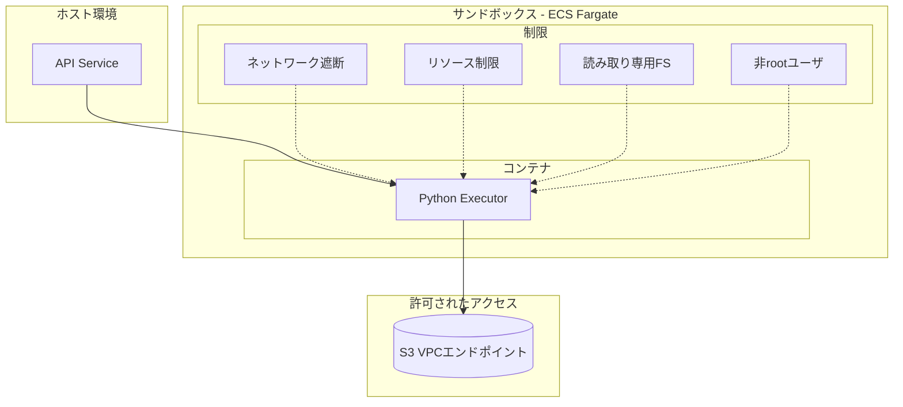
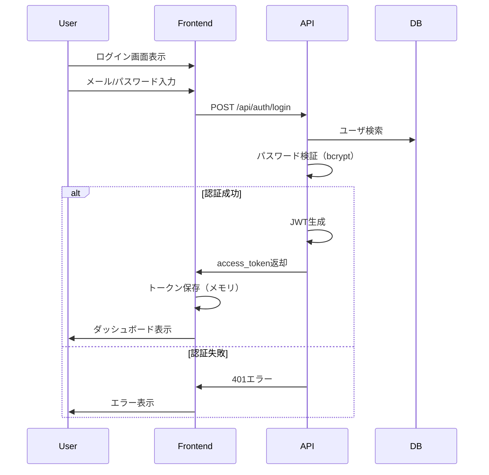

# 社内BI・Pythonカード セキュリティ実装ガイド v0.2

Last Updated: 2026-02-05

## このドキュメントについて

- 役割: セキュリティ実装の詳細仕様（サンドボックス、CSP、認証・認可、監査ログ）
- 関連: 技術仕様は [tech-spec.md](tech-spec.md)、データフローは [data-flow.md](data-flow.md) を参照

## 1. セキュリティ概要

### 1.1 脅威モデル

| 脅威 | 影響 | 対策 |
|------|------|------|
| 悪意のあるPythonコード実行 | サーバ侵害、データ漏洩 | サンドボックス、ネットワーク遮断 |
| XSS（クロスサイトスクリプティング） | セッションハイジャック、情報窃取 | iframe分離、CSP |
| 不正アクセス | データ漏洩 | 認証・認可 |
| 権限昇格 | 不正操作 | 権限チェック |
| Permission bypass (ダッシュボード) | 未認可ユーザーが非公開ダッシュボードの閲覧・編集・削除を実行 | `PermissionService` による3段階アクセス制御 (owner / direct share / group share) |
| Permission bypass (管理機能) | admin 以外のユーザーがグループ管理・ユーザー検索にアクセス | `require_admin` 依存性注入による admin ロール必須チェック |
| データ露出 | 意図しないデータ共有 | Dataset可視化、監査ログ |
| S3バケット不正アクセス | S3 Import機能で意図しない外部バケットにアクセス | IAMポリシーによるバケット制限、バケット名バリデーション |
| CSVインジェクション | S3経由で悪意あるCSVデータを取り込み | CSVパース時のサニタイズ、ファイルサイズ制限 |

### 1.2 セキュリティ原則

1. `最小権限の原則`: 必要最小限の権限のみ付与
2. `多層防御`: 複数のセキュリティレイヤで保護
3. `デフォルト拒否`: 明示的に許可されていないものは拒否
4. `監査可能性`: 全ての重要操作をログに記録

---

## 2. Python実行基盤セキュリティ

### 2.1 サンドボックス設計



### 2.2 Dockerfile（実行基盤）

```dockerfile
# executor/Dockerfile
FROM python:3.11-slim AS base

# 非rootユーザ作成
RUN groupadd -r executor && useradd -r -g executor executor

# 依存ライブラリのみインストール（ホワイトリスト）
COPY requirements.txt /tmp/requirements.txt
RUN pip install --no-cache-dir -r /tmp/requirements.txt

# アプリケーションコピー
WORKDIR /app
COPY --chown=executor:executor app/ /app/

# 一時ディレクトリのみ書き込み可能
RUN mkdir -p /tmp/workdir && chown executor:executor /tmp/workdir

# 非rootユーザに切り替え
USER executor

# 読み取り専用ルートファイルシステムで実行
# (ECSタスク定義で readonlyRootFilesystem: true を設定)

ENV PYTHONUNBUFFERED=1
ENV PYTHONDONTWRITEBYTECODE=1

CMD ["python", "-m", "app.main"]
```

### 2.3 ホワイトリストライブラリ

```txt
# executor/requirements.txt
# データ処理
pandas==2.2.0
pyarrow==15.0.0
numpy==1.26.3

# 可視化
plotly==5.18.0
matplotlib==3.8.2
seaborn==0.13.1

# ユーティリティ
python-dateutil==2.8.2

# 以下は禁止（インストールしない）
# requests, httpx, urllib3 - HTTPクライアント
# socket - ソケット通信
# subprocess - プロセス実行
# os.system, os.popen - シェル実行
# importlib - 動的インポート
```

### 2.4 ネットワーク分離（ECSタスク定義）

```json
{
  "family": "bi-executor",
  "networkMode": "awsvpc",
  "containerDefinitions": [
    {
      "name": "executor",
      "image": "xxx.dkr.ecr.ap-northeast-1.amazonaws.com/bi-executor:latest",
      "cpu": 1024,
      "memory": 2048,
      "readonlyRootFilesystem": true,
      "user": "executor",
      "linuxParameters": {
        "capabilities": {
          "drop": ["ALL"]
        }
      },
      "mountPoints": [
        {
          "sourceVolume": "tmp",
          "containerPath": "/tmp",
          "readOnly": false
        }
      ]
    }
  ],
  "volumes": [
    {
      "name": "tmp",
      "host": {}
    }
  ]
}
```

### 2.5 セキュリティグループ

```hcl
# infra/modules/ecs/security_groups.tf

# Executor用セキュリティグループ
resource "aws_security_group" "executor" {
  name        = "bi-executor-sg"
  description = "Security group for BI executor"
  vpc_id      = var.vpc_id

  # インバウンド: API からのみ許可
  ingress {
    from_port       = 8080
    to_port         = 8080
    protocol        = "tcp"
    security_groups = [aws_security_group.api.id]
  }

  # アウトバウンド: S3 VPCエンドポイントのみ許可
  egress {
    from_port       = 443
    to_port         = 443
    protocol        = "tcp"
    prefix_list_ids = [aws_vpc_endpoint.s3.prefix_list_id]
  }

  # 外部ネットワークへのアクセスは禁止（デフォルト拒否）
}
```

### 2.6 コード実行時のセキュリティ

```python
# executor/app/sandbox.py
import sys
import builtins
from types import ModuleType

class SecureExecutor:
    """安全なPythonコード実行"""
    
    # 禁止する組み込み関数
    BLOCKED_BUILTINS = {
        'open', 'exec', 'eval', 'compile',
        '__import__', 'input', 'breakpoint',
    }
    
    # 禁止するモジュール
    BLOCKED_MODULES = {
        'os', 'sys', 'subprocess', 'socket',
        'http', 'urllib', 'requests', 'httpx',
        'ftplib', 'smtplib', 'telnetlib',
        'pickle', 'shelve', 'marshal',
        'ctypes', 'multiprocessing',
        'threading',  # 制限付きで許可する場合もある
    }
    
    def __init__(self):
        self.safe_builtins = self._create_safe_builtins()
    
    def _create_safe_builtins(self) -> dict:
        """安全な組み込み関数のみを含む辞書を作成"""
        safe = {}
        for name in dir(builtins):
            if name not in self.BLOCKED_BUILTINS and not name.startswith('_'):
                safe[name] = getattr(builtins, name)
        
        # openをブロック
        safe['open'] = self._blocked_open
        
        return safe
    
    def _blocked_open(self, *args, **kwargs):
        raise PermissionError("ファイルアクセスは許可されていません")
    
    def _create_import_hook(self):
        """禁止モジュールのインポートをブロック"""
        original_import = builtins.__import__
        blocked = self.BLOCKED_MODULES
        
        def secure_import(name, globals=None, locals=None, fromlist=(), level=0):
            # トップレベルモジュール名を取得
            top_module = name.split('.')[0]
            
            if top_module in blocked:
                raise ImportError(f"モジュール '{name}' のインポートは許可されていません")
            
            return original_import(name, globals, locals, fromlist, level)
        
        return secure_import
    
    def execute(self, code: str, inputs: dict, params: dict) -> any:
        """コードを安全に実行"""
        # インポートフック設定
        original_import = builtins.__import__
        builtins.__import__ = self._create_import_hook()
        
        try:
            # 安全な名前空間
            globals_dict = {
                '__builtins__': self.safe_builtins,
                '__name__': '__main__',
                'pd': __import__('pandas'),
                'np': __import__('numpy'),
                'px': __import__('plotly.express'),
                'go': __import__('plotly.graph_objects'),
            }
            
            locals_dict = {}
            
            # コンパイル（構文エラー検出）
            compiled = compile(code, '<user_code>', 'exec')
            
            # 実行
            exec(compiled, globals_dict, locals_dict)
            
            return locals_dict
            
        finally:
            # インポートフック復元
            builtins.__import__ = original_import
```

### 2.7 リソース制限

> 詳細は [tech-spec.md Section 3.2](tech-spec.md#32-リソース制限) を参照

### 2.8 S3 Import セキュリティ考慮事項

S3バケットアクセス制御:
- IAMポリシーで許可バケットを明示的に制限
- ワイルドカードによる全バケットアクセスを禁止
- 本番環境では許可バケットリストを環境変数で管理

S3キーのパストラバーサル防止:
```python
import re

def validate_s3_key(s3_key: str) -> bool:
    """S3キーのバリデーション"""
    # パストラバーサル防止
    if '..' in s3_key:
        return False
    # 許可される文字パターン
    if not re.match(r'^[a-zA-Z0-9\-_./]+$', s3_key):
        return False
    # 先頭スラッシュ禁止
    if s3_key.startswith('/'):
        return False
    return True
```

CSVインジェクション対策:
- 既存のCSV解析処理 (`CsvParser`) でサニタイズ
- 数式プレフィックス (`=`, `+`, `-`, `@`) の検出と無害化
- ファイルサイズ上限の適用 (デフォルト: 100MB)

ファイルサイズ制限:
- S3 Import時のファイルサイズ上限: 100MB (設定可能)
- `Content-Length` ヘッダまたは `HeadObject` で事前チェック
- 上限超過時は 400 `VALIDATION_ERROR` を返却

監査ログ:
- S3 Import操作は `DATASET_IMPORTED` イベントとして記録
- `source_type: "s3_csv"` と `source_config` (バケット名、キー) を `details` に含む

---

## 3. HTMLカード表示セキュリティ

### 3.1 iframe分離

```tsx
// frontend/src/components/dashboard/CardContainer.tsx
import React from 'react';

interface CardContainerProps {
  cardId: string;
  html: string;
}

export const CardContainer: React.FC<CardContainerProps> = ({ cardId, html }) => {
  // サニタイズ済みHTMLをiframeで表示
  const srcDoc = `
    <!DOCTYPE html>
    <html>
    <head>
      <meta charset="utf-8">
      <meta http-equiv="Content-Security-Policy" content="${getCSP()}">
      <style>
        body { margin: 0; padding: 16px; font-family: sans-serif; }
      </style>
    </head>
    <body>
      ${html}
    </body>
    </html>
  `;

  return (
    <iframe
      title={`card-${cardId}`}
      sandbox="allow-scripts"
      srcDoc={srcDoc}
      style={{
        width: '100%',
        height: '100%',
        border: 'none',
      }}
    />
  );
};

function getCSP(): string {
  return [
    "default-src 'none'",
    "script-src 'unsafe-inline' https://cdn.internal.company.com",
    "style-src 'unsafe-inline'",
    "img-src data: blob:",
    "font-src https://cdn.internal.company.com",
  ].join('; ');
}
```

### 3.2 CSP設定詳細

```python
# backend/app/core/security.py

CSP_DIRECTIVES = {
    # デフォルトは全て禁止
    "default-src": ["'none'"],
    
    # スクリプト: 社内CDNのPlotly等のみ許可
    # unsafe-inline は Plotly のインラインスクリプトに必要
    "script-src": [
        "'unsafe-inline'",
        "https://cdn.internal.company.com",
    ],
    
    # スタイル: インラインスタイル許可（Plotlyに必要）
    "style-src": [
        "'unsafe-inline'",
    ],
    
    # 画像: data URL（Base64）とblob許可
    "img-src": [
        "data:",
        "blob:",
    ],
    
    # フォント: 社内CDNのみ
    "font-src": [
        "https://cdn.internal.company.com",
    ],
    
    # 接続: 禁止（外部通信不可）
    "connect-src": ["'none'"],
    
    # フレーム: 禁止
    "frame-src": ["'none'"],
    
    # フォーム送信: 禁止
    "form-action": ["'none'"],
    
    # ベースURL: 禁止
    "base-uri": ["'none'"],
}

def build_csp_header() -> str:
    """CSPヘッダ文字列を構築"""
    parts = []
    for directive, values in CSP_DIRECTIVES.items():
        parts.append(f"{directive} {' '.join(values)}")
    return "; ".join(parts)
```

### 3.3 許可JSライブラリ管理

```python
# backend/app/core/allowed_scripts.py

# 許可するJSライブラリとバージョン
ALLOWED_SCRIPTS = {
    "plotly": {
        "version": "2.27.0",
        "url": "https://cdn.internal.company.com/plotly/2.27.0/plotly.min.js",
        "integrity": "sha384-xxxx...",  # SRI ハッシュ
    },
}

def get_script_tags() -> str:
    """許可されたスクリプトタグを生成"""
    tags = []
    for name, info in ALLOWED_SCRIPTS.items():
        tag = f'<script src="{info["url"]}" integrity="{info["integrity"]}" crossorigin="anonymous"></script>'
        tags.append(tag)
    return "\n".join(tags)
```

---

## 4. 認証・認可

### 4.1 認証フロー



### 4.2 JWT実装

```python
# backend/app/core/security.py
from datetime import datetime, timedelta
from jose import jwt, JWTError
from passlib.context import CryptContext

# パスワードハッシュ設定
pwd_context = CryptContext(
    schemes=["bcrypt"],
    deprecated="auto",
    bcrypt__rounds=12,
)

# JWT設定
JWT_SECRET_KEY = os.environ["JWT_SECRET_KEY"]  # 最低32文字
JWT_ALGORITHM = "HS256"
JWT_EXPIRE_MINUTES = 60 * 24  # 24時間

class AuthService:
    def hash_password(self, password: str) -> str:
        """パスワードをハッシュ化"""
        return pwd_context.hash(password)
    
    def verify_password(self, plain: str, hashed: str) -> bool:
        """パスワードを検証"""
        return pwd_context.verify(plain, hashed)
    
    def create_access_token(self, user_id: str) -> str:
        """アクセストークン生成"""
        expire = datetime.utcnow() + timedelta(minutes=JWT_EXPIRE_MINUTES)
        
        payload = {
            "sub": user_id,
            "exp": expire,
            "iat": datetime.utcnow(),
            "type": "access",
        }
        
        return jwt.encode(payload, JWT_SECRET_KEY, algorithm=JWT_ALGORITHM)
    
    def verify_token(self, token: str) -> dict:
        """トークン検証"""
        try:
            payload = jwt.decode(token, JWT_SECRET_KEY, algorithms=[JWT_ALGORITHM])
            
            if payload.get("type") != "access":
                raise ValueError("Invalid token type")
            
            return payload
            
        except JWTError as e:
            raise ValueError(f"Token verification failed: {e}")
```

### 4.3 パスワードポリシー

```python
# backend/app/core/password_policy.py
import re

class PasswordPolicy:
    MIN_LENGTH = 8
    MAX_LENGTH = 128
    
    @classmethod
    def validate(cls, password: str) -> list[str]:
        """パスワードポリシーを検証"""
        errors = []
        
        if len(password) < cls.MIN_LENGTH:
            errors.append(f"パスワードは{cls.MIN_LENGTH}文字以上必要です")
        
        if len(password) > cls.MAX_LENGTH:
            errors.append(f"パスワードは{cls.MAX_LENGTH}文字以下にしてください")
        
        if not re.search(r'[A-Z]', password):
            errors.append("英大文字を1文字以上含めてください")
        
        if not re.search(r'[a-z]', password):
            errors.append("英小文字を1文字以上含めてください")
        
        if not re.search(r'[0-9]', password):
            errors.append("数字を1文字以上含めてください")
        
        # 連続する同一文字のチェック
        if re.search(r'(.)\1{2,}', password):
            errors.append("同じ文字を3回以上連続させないでください")
        
        return errors
```

### 4.4 認可チェック

#### 4.4.1 `get_current_user` -- 認証済みユーザー取得

全ての保護されたエンドポイントで使用される FastAPI 依存性注入。
JWT トークンからユーザーIDを取得し、DynamoDB からユーザーレコードを検索する。
戻り値は `User` モデル（`hashed_password` を含まない公開モデル）。

- トークンが無効またはユーザーが存在しない場合: `401 Unauthorized`

ソース: `backend/app/api/deps.py` -- `get_current_user()`

#### 4.4.2 `require_admin` -- admin ロール必須チェック

`get_current_user` に依存し、ユーザーの `role` が `"admin"` であることを検証する FastAPI 依存性注入。
admin 以外のユーザーがアクセスした場合は `403 Forbidden` を返す。

使用箇所:
- `GET/POST/PUT/DELETE /api/groups/**` -- グループ CRUD 全操作
- `POST/DELETE /api/groups/{group_id}/members/**` -- グループメンバー管理

```python
# backend/app/api/deps.py (実装抜粋)
def require_admin(current_user: User = Depends(get_current_user)) -> User:
    if current_user.role != "admin":
        raise HTTPException(
            status_code=status.HTTP_403_FORBIDDEN,
            detail="Admin access required",
        )
    return current_user
```

#### 4.4.3 `PermissionService` -- ダッシュボード権限サービス

ダッシュボードへのアクセス権限を判定するサービスクラス。
`backend/app/services/permission_service.py` に実装。

主要メソッド:

| メソッド | 説明 | 戻り値 |
|----------|------|--------|
| `get_user_permission()` | ユーザーが持つ最高権限レベルを返す | `Permission` or `None` |
| `check_permission()` | 指定権限以上を持つか判定 | `bool` |
| `assert_permission()` | 権限不足の場合 `403 Forbidden` を送出 | `None` (例外送出) |

#### 4.4.4 パーミッション階層

`Permission` enum と数値レベルの対応（`backend/app/models/dashboard_share.py`）:

| レベル | 値 | 数値 | 許可される操作 |
|--------|-----|------|----------------|
| `VIEWER` | `"viewer"` | 1 | ダッシュボード閲覧、クローン |
| `EDITOR` | `"editor"` | 2 | 閲覧 + ダッシュボード編集（名前、レイアウト、フィルタ） |
| `OWNER`  | `"owner"`  | 3 | 閲覧 + 編集 + 共有管理（追加/変更/削除）+ ダッシュボード削除 |

権限判定は数値比較で行われる。`PERMISSION_LEVELS` 辞書で enum を数値にマッピングし、
`actual_level >= required_level` で判定する。

```python
# backend/app/services/permission_service.py (実装抜粋)
PERMISSION_LEVELS = {
    Permission.VIEWER: 1,
    Permission.EDITOR: 2,
    Permission.OWNER: 3,
}
```

#### 4.4.5 パーミッションチェックフロー

> 詳細は [data-flow.md Section 2](data-flow.md#2-権限チェックフロー) を参照

---

## 5. 監査ログ

### 5.1 監査対象イベント

| イベント種別 | 説明 | 重要度 |
|-------------|------|--------|
| USER_LOGIN | ログイン | 中 |
| USER_LOGOUT | ログアウト | 低 |
| USER_LOGIN_FAILED | ログイン失敗 | 高 |
| DASHBOARD_SHARE_ADDED | 共有追加 | 高 |
| DASHBOARD_SHARE_REMOVED | 共有削除 | 高 |
| DASHBOARD_SHARE_UPDATED | 共有更新 | 高 |
| DATASET_CREATED | Dataset作成 | 中 |
| DATASET_IMPORTED | Dataset取り込み | 中 |
| DATASET_DELETED | Dataset削除 | 高 |
| TRANSFORM_EXECUTED | Transform実行 | 中 |
| TRANSFORM_FAILED | Transform失敗 | 高 |
| CARD_EXECUTION_FAILED | カード実行失敗 | 中 |

### 5.2 監査ログ実装

```python
# backend/app/services/audit_service.py
from datetime import datetime
import uuid

class AuditService:
    def __init__(self, dynamodb_client):
        self.db = dynamodb_client
        self.table_name = "bi_audit_logs"
    
    async def log(
        self,
        event_type: str,
        user_id: str,
        target_type: str,
        target_id: str,
        details: dict = None,
        request_id: str = None,
    ):
        """監査ログを記録"""
        log_entry = {
            "log_id": str(uuid.uuid4()),
            "timestamp": int(datetime.utcnow().timestamp() * 1000),
            "event_type": event_type,
            "user_id": user_id,
            "target_type": target_type,
            "target_id": target_id,
            "details": details or {},
            "request_id": request_id,
        }
        
        await self.db.put_item(
            TableName=self.table_name,
            Item=self._serialize(log_entry),
        )
    
    async def query_by_target(
        self,
        target_id: str,
        start_time: datetime = None,
        end_time: datetime = None,
        limit: int = 100,
    ) -> list[dict]:
        """対象別にログを検索"""
        # GSI: LogsByTarget を使用
        ...
    
    async def query_by_time_range(
        self,
        start_time: datetime,
        end_time: datetime,
        event_type: str = None,
        limit: int = 100,
    ) -> list[dict]:
        """時間範囲でログを検索"""
        # GSI: LogsByTimestamp を使用
        ...
```

### 5.3 監査ログ使用例

```python
# backend/app/api/routes/dashboards.py
@router.post("/{dashboard_id}/shares")
async def add_share(
    dashboard_id: str,
    share_request: ShareRequest,
    current_user: User = Depends(get_current_user),
    audit_service: AuditService = Depends(),
):
    # 権限チェック
    ...
    
    # 共有追加
    share = await share_repo.create(...)
    
    # 監査ログ
    await audit_service.log(
        event_type="DASHBOARD_SHARE_ADDED",
        user_id=current_user.user_id,
        target_type="Dashboard",
        target_id=dashboard_id,
        details={
            "shared_to_type": share_request.shared_to_type,
            "shared_to_id": share_request.shared_to_id,
            "permission": share_request.permission,
        },
    )
    
    return share
```

---

## 6. データ保護

### 6.1 データ露出防止

#### `my_permission` フィールド

ダッシュボード一覧 API (`GET /api/dashboards`) は、各ダッシュボードに `my_permission` フィールドを付与して返却する。
このフィールドはリクエストユーザーが対象ダッシュボードに対して持つ実効権限を示す文字列で、
値は `"owner"`, `"editor"`, `"viewer"` のいずれか。

`my_permission` の算出ロジック（`backend/app/api/routes/dashboards.py` -- `list_dashboards()`）:

1. ユーザーが所有するダッシュボード -> `"owner"`
2. ユーザー直接共有 -> 共有レコードの `permission` 値
3. グループ共有 -> 共有レコードの `permission` 値
4. 複数の共有が存在する場合は最も高い権限レベルが採用される

フロントエンドはこのフィールドを参照して UI の表示制御を行う（編集ボタンの表示/非表示、共有メニューの可否など）。
サーバーサイドの権限チェックは各操作エンドポイントで独立して実施されるため、
`my_permission` は UI ヒントとしてのみ使用される。サーバーサイドの認可を代替するものではない。

#### 参照 Dataset の可視化

```python
# backend/app/services/dashboard_service.py

class DashboardService:
    async def get_referenced_datasets(self, dashboard_id: str) -> list[dict]:
        """Dashboardが参照しているDatasetを取得（共有時の警告用）"""
        dashboard = await self.dashboard_repo.get_by_id(dashboard_id)
        
        dataset_ids = set()
        for card_ref in dashboard.layout.get("cards", []):
            card = await self.card_repo.get_by_id(card_ref["card_id"])
            if card:
                dataset_ids.add(card.dataset_id)
        
        datasets = []
        for dataset_id in dataset_ids:
            dataset = await self.dataset_repo.get_by_id(dataset_id)
            if dataset:
                datasets.append({
                    "dataset_id": dataset.dataset_id,
                    "name": dataset.name,
                    "row_count": dataset.row_count,
                    "owner": {
                        "user_id": dataset.owner_id,
                        "name": await self._get_user_name(dataset.owner_id),
                    },
                })
        
        return datasets
```

### 6.2 共有時の警告UI

```tsx
// frontend/src/components/dashboard/ShareDialog.tsx

export const ShareDialog: React.FC<ShareDialogProps> = ({ dashboardId, onClose }) => {
  const { data: referencedDatasets } = useQuery(
    ['dashboard-datasets', dashboardId],
    () => api.getDashboardReferencedDatasets(dashboardId)
  );

  return (
    <Dialog open onOpenChange={onClose}>
      <DialogContent>
        <DialogHeader>
          <DialogTitle>ダッシュボードを共有</DialogTitle>
        </DialogHeader>

        {/* 参照Datasetの警告表示 */}
        {referencedDatasets && referencedDatasets.length > 0 && (
          <Alert variant="warning">
            <AlertTitle>データアクセスに関する注意</AlertTitle>
            <AlertDescription>
              このダッシュボードを共有すると、以下のDatasetへのアクセスが許可されます:
              <ul className="mt-2 list-disc list-inside">
                {referencedDatasets.map((ds) => (
                  <li key={ds.dataset_id}>
                    {ds.name} ({ds.row_count.toLocaleString()}行)
                  </li>
                ))}
              </ul>
            </AlertDescription>
          </Alert>
        )}

        {/* 共有設定フォーム */}
        <ShareForm dashboardId={dashboardId} />
      </DialogContent>
    </Dialog>
  );
};
```

---

## 7. シークレット管理

### 7.1 AWS Secrets Manager

```python
# backend/app/core/secrets.py
import boto3
import json
from functools import lru_cache

class SecretsManager:
    def __init__(self):
        self.client = boto3.client('secretsmanager')
    
    @lru_cache(maxsize=10)
    def get_secret(self, secret_name: str) -> dict:
        """シークレットを取得（キャッシュ付き）"""
        response = self.client.get_secret_value(SecretId=secret_name)
        return json.loads(response['SecretString'])

# 使用例
secrets = SecretsManager()

# JWT シークレット
jwt_secret = secrets.get_secret("bi/jwt")["secret_key"]

# Vertex AI サービスアカウント
vertex_ai_sa = secrets.get_secret("bi/vertex-ai")["service_account_key"]
```

### 7.2 環境変数の分離

```python
# backend/app/core/config.py
from pydantic_settings import BaseSettings

class Settings(BaseSettings):
    # 環境
    env: str = "local"
    
    # 非シークレット
    api_host: str = "0.0.0.0"
    api_port: int = 8000
    
    # シークレット（本番はSecrets Managerから）
    jwt_secret_key: str  # 必須
    
    # AWS
    aws_region: str = "ap-northeast-1"
    dynamodb_endpoint: str | None = None  # ローカルのみ
    s3_endpoint: str | None = None  # ローカルのみ
    
    class Config:
        env_file = ".env"
        env_file_encoding = "utf-8"

settings = Settings()
```

---

## 8. セキュリティチェックリスト

### 8.1 デプロイ前チェック

- [ ] JWT_SECRET_KEY が32文字以上で十分にランダム
- [ ] パスワードハッシュのワークファクターが12以上
- [ ] CSP設定が適用されている
- [ ] iframe sandbox属性が設定されている
- [ ] Executorのセキュリティグループが外部通信を遮断している
- [ ] Executorが非rootユーザで実行されている
- [ ] 読み取り専用ファイルシステムが有効
- [ ] 監査ログが有効
- [ ] シークレットがSecrets Managerで管理されている

### 8.2 定期レビュー項目

- [ ] ホワイトリストライブラリのバージョン更新
- [ ] CSP設定の見直し
- [ ] 監査ログのレビュー
- [ ] アクセス権限の棚卸し
- [ ] 依存ライブラリの脆弱性スキャン
